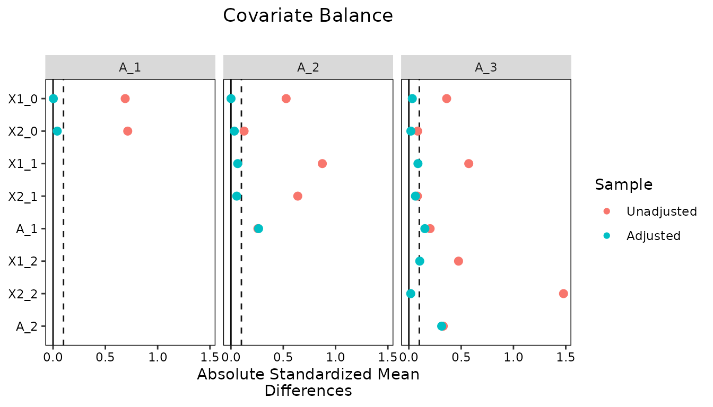

# Longitudinal Treatments

## Introduction

A longitudinal treatment is one that can be received, or not, at each of
several time points, so that each unit has a treatment history rather
than a single treatment status. Examples include a medication that can
be started, stopped, and restarted at each clinic visit, a program a
student can enroll in each semester, and a policy a jurisdiction can
adopt in any year. The causal questions in these settings concern the
joint effect of the treatments received across time: what would happen
if units were treated at every time point compared with none, or at the
first time point only compared with the last. Answering them requires
accounting for *time-varying confounding*, in which covariates that are
affected by earlier treatments go on to affect later treatments and the
outcome. Standard regression adjustment cannot handle this ([Daniel et
al. 2013](#ref-danielMethodsDealingTimedependent2013); [Mansournia et
al. 2017](#ref-mansourniaHandlingTimeVarying2017)), and weighting is the
usual remedy: weights are estimated for each unit’s treatment history
and used to fit a *marginal structural model* (MSM) for the outcome as a
function of the treatment history ([Robins et al.
2000](#ref-robinsMarginalStructuralModels2000); [Hernán et al.
2000](#ref-hernanMarginalStructuralModels2000)). For introductions to
MSMs, see Thoemmes and Ong
([2016](#ref-thoemmesPrimerInverseProbability2016)), VanderWeele et al.
([2016](#ref-vanderweeleCausalInferenceLongitudinal2016)), Cole and
Hernán ([2008](#ref-coleConstructingInverseProbability2008)), Williamson
and Ravani ([2017](#ref-williamsonMarginalStructuralModels2017)),
Stallworthy et al.
([2026](#ref-stallworthyInvestigatingCausalQuestions2026)), and Hernán
and Robins ([2020](#ref-hernanCausalInferenceWhat2020)).

In *WeightIt*, weights for longitudinal treatments are estimated with
[`weightitMSM()`](https://ngreifer.github.io/WeightIt/reference/weightitMSM.md),
which fits a model for the treatment at each time point and multiplies
the resulting weights together. This vignette explains the estimand and
assumptions that are specific to longitudinal treatments and then walks
through an analysis: estimating the weights, assessing balance at each
time point, and estimating the joint effect of the treatments with an
MSM. A second, briefer analysis shows how to account for loss to
follow-up by including censoring weights in the same workflow. The two
analyses use the simulated `msmdata` dataset included with *WeightIt*.
For an introduction to the functions in *WeightIt*, see
[`vignette("WeightIt")`](https://ngreifer.github.io/WeightIt/articles/WeightIt.md);
for the weighting methods available, see
[`vignette("weighting-methods")`](https://ngreifer.github.io/WeightIt/articles/weighting-methods.md);
for effect estimation in general, see
[`vignette("estimating-effects")`](https://ngreifer.github.io/WeightIt/articles/estimating-effects.md);
and for a fuller treatment of balance assessment with longitudinal
treatments, see
[`vignette("longitudinal-treat", package = "cobalt")`](https://ngreifer.github.io/cobalt/articles/longitudinal-treat.html).

## Marginal Structural Models for Longitudinal Treatments

### The Estimand

Consider a study with \\K\\ time points. At each time point \\k\\,
covariates \\L_k\\ are measured and then a treatment \\A_k\\ is
received; \\L_1\\ contains the baseline covariates, and for \\k \> 1\\,
\\L_k\\ contains the covariates measured after treatment \\A\_{k-1}\\
and before treatment \\A_k\\. The outcome \\Y\\ is measured after the
last treatment. We write \\\bar{A}\_k = (A_1, \ldots, A_k)\\ for the
treatment history through time \\k\\ and \\\bar{L}\_k = (L_1, \ldots,
L_k)\\ for the covariate history, with \\\bar{A} = \bar{A}\_K\\ the full
treatment history. A *treatment regime* \\\bar{a} = (a_1, \ldots, a_K)\\
is a particular sequence of treatment values, and \\Y(\bar{a})\\ is the
potential outcome a unit would have had under regime \\\bar{a}\\. With a
binary treatment and three time points, there are eight regimes, from
never treated, \\(0, 0, 0)\\, to always treated, \\(1, 1, 1)\\.

The estimands of interest are the expected potential outcomes under each
regime, \\E\[Y(\bar{a})\]\\, and contrasts between them. The contrast
between always treated and never treated, \\E\[Y(1, 1, 1)\] - E\[Y(0, 0,
0)\]\\, is the most common, but any pair of regimes can be compared, and
the pattern across regimes answers questions about timing and duration,
such as whether treatment at the last time point matters more than
treatment at the first ([Stallworthy et al.
2026](#ref-stallworthyInvestigatingCausalQuestions2026)). These are
*joint* effects of the entire regime, not the effect of any one
treatment holding the others fixed, and they are defined for the
population from which the sample was drawn, so the estimand corresponds
to the average treatment effect in the population (ATE); the other
estimands available for point treatments do not apply.

A marginal structural model is a model for \\E\[Y(\bar{a})\]\\ as a
function of the regime ([Robins et al.
2000](#ref-robinsMarginalStructuralModels2000); [Robins
2000](#ref-robinsMarginalStructuralModels2000a)). It is *marginal*
because it concerns the marginal distribution of the potential outcomes,
averaged over the covariates, and *structural* because it describes
potential rather than observed outcomes. For a binary outcome and three
time points, a *saturated* MSM has a parameter for every regime,
\\\text{logit}\\ E\[Y(a_1, a_2, a_3)\] = \beta_0 + \beta_1 a_1 + \beta_2
a_2 + \beta_3 a_3 + \beta_4 a_1 a_2 + \beta_5 a_1 a_3 + \beta_6 a_2
a_3 + \beta_7 a_1 a_2 a_3,\\ and imposes no assumptions about how the
regimes relate to each other. A parsimonious MSM, such as one with only
the main effects of the three treatments or one in which the outcome
depends only on the number of time points treated, has fewer parameters
and is more precise, but it is a modeling assumption that can be wrong.
With few time points, the saturated model is preferable, and the simpler
summaries a parsimonious model would provide, such as the average effect
of treatment at one time point, can be recovered from it afterward, as
we show below; with many time points, a parsimonious model is a
practical necessity.

### Time-Varying Confounding

With a point treatment, confounding is addressed by adjusting for the
covariates that affect both the treatment and the outcome. With a
longitudinal treatment, the covariates measured between treatments play
a double role. A covariate \\L_2\\ measured after \\A_1\\ may be
affected by \\A_1\\, affect \\A_2\\, and affect \\Y\\: it is a
confounder of the effect of \\A_2\\ and, at the same time, a mediator of
the effect of \\A_1\\. Adjusting for \\L_2\\ in a regression of \\Y\\ on
the treatment history removes the confounding of \\A_2\\ but blocks the
part of the effect of \\A_1\\ that runs through \\L_2\\ and, if \\L_2\\
and \\Y\\ share an unmeasured cause, opens a non-causal path between
\\A_1\\ and \\Y\\ (collider stratification). Not adjusting for \\L_2\\
leaves the effect of \\A_2\\ confounded. No choice of covariates for the
regression yields the joint effect of the regime ([Robins
1986](#ref-robinsNewApproachCausal1986); [Robins et al.
2000](#ref-robinsMarginalStructuralModels2000); [Daniel et al.
2013](#ref-danielMethodsDealingTimedependent2013); [Hernán and Robins
2020](#ref-hernanCausalInferenceWhat2020)).

Weighting escapes this dilemma because it uses the covariates to
construct the weights rather than as terms in the outcome model. In the
weighted sample, each treatment is independent of the covariate and
treatment history that precedes it, as it would be in a sequentially
randomized trial in which treatment at each time point is assigned at
random, possibly with probabilities that depend on the past. The MSM is
then fit to the weighted sample with only the treatment history (and,
optionally, baseline covariates) on the right hand side, so the
covariates affected by earlier treatments never enter the outcome model.

### Assumptions

The weighting estimator of an MSM identifies the joint effects under the
longitudinal versions of the usual assumptions ([Robins et al.
2000](#ref-robinsMarginalStructuralModels2000); [Hernán and Robins
2020](#ref-hernanCausalInferenceWhat2020)).

**Sequential exchangeability.** At each time point, treatment is
independent of the potential outcomes given the observed history:
\\Y(\bar{a}) \perp A_k \mid \bar{A}\_{k-1} = \bar{a}\_{k-1},
\bar{L}\_k\\ for every \\k\\ and every regime \\\bar{a}\\. This is the
assumption of no unmeasured confounding applied one time point at a
time, and it requires that the covariates measured before each treatment
include all the confounders of that treatment and the outcome, including
the earlier treatments themselves. It cannot be verified from the data;
its plausibility depends on what was measured and when.

**Positivity.** Every regime must have a positive probability of being
received at every history that occurs in the population: \\P(A_k = a_k
\mid \bar{A}\_{k-1} = \bar{a}\_{k-1}, \bar{L}\_k = \bar{l}\_k) \> 0\\
for all \\a_k\\ and all histories \\(\bar{a}\_{k-1}, \bar{l}\_k)\\ with
positive probability. Positivity is harder to satisfy with longitudinal
treatments than with point treatments because it must hold at every time
point, and because some treatment histories may be rare or absent by
design (e.g., when a treatment, once started, is never stopped).
Near-violations show up as very large weights ([Westreich and Cole
2010](#ref-westreichInvitedCommentaryPositivity2010); [Platt et al.
2012](#ref-plattPositivityAssumptionMarginal2012); [Cole and Hernán
2008](#ref-coleConstructingInverseProbability2008)).

**Consistency and no interference.** A unit’s observed outcome is its
potential outcome under the regime it actually received, and a unit’s
outcome does not depend on the treatments other units receive.

**Correct specification.** The models for treatment at each time point
must be correctly specified, or at least must produce weights that
balance the covariates at each time point, and the MSM must be correctly
specified as a function of the regime. Misspecification of the treatment
models biases the weights and the estimate ([Lefebvre et al.
2008](#ref-lefebvreImpactMisspecificationTreatment2008)), which is why
balance is assessed at every time point.

### Inverse Probability Weights

The weights for an MSM are the product over time points of the inverse
of the probability of the treatment actually received, given the history
to that point ([Robins et al.
2000](#ref-robinsMarginalStructuralModels2000)): \\w_i =
\prod\_{k=1}^{K} \frac{1}{P(A_k = A\_{ik} \mid \bar{A}\_{k-1} =
\bar{A}\_{i,k-1}, \bar{L}\_k = \bar{L}\_{ik})}.\\ Each factor is the
weight that would be estimated for a point treatment at time \\k\\ with
the history through time \\k\\ as the covariates, and this is how
[`weightitMSM()`](https://ngreifer.github.io/WeightIt/reference/weightitMSM.md)
computes them: it fits a treatment model at each time point using the
formula supplied for that time point and multiplies the weights across
time points. The factors can be estimated with any of the methods
described in
[`vignette("weighting-methods")`](https://ngreifer.github.io/WeightIt/articles/weighting-methods.md)
that support longitudinal treatments, which are the methods that
estimate a propensity score (`"glm"`, `"gbm"`, `"super"`, `"bart"`,
`"cbps"`, and `"ipt"`); the optimization-based methods, which do not,
cannot be used this way. The covariate balancing propensity score can
alternatively estimate all the time points’ models at once so that the
product of the weights balances the covariates at every time point,
which is requested with `is.MSM.method = TRUE` (see [Imai and Ratkovic
2015](#ref-imaiRobustEstimationInverse2015) for a related approach).

The product of many inverse probabilities can be very variable, and the
weights for a longitudinal treatment are often much more extreme than
for a point treatment. *Stabilized* weights replace the numerator of
each factor with the probability of the observed treatment given the
treatment history alone: \\sw_i = \prod\_{k=1}^{K} \frac{P(A_k = A\_{ik}
\mid \bar{A}\_{k-1} = \bar{A}\_{i,k-1})}{P(A_k = A\_{ik} \mid
\bar{A}\_{k-1} = \bar{A}\_{i,k-1}, \bar{L}\_k = \bar{L}\_{ik})}.\\
Stabilized weights have a mean of 1, are far less variable than
unstabilized weights, and yield more precise estimates ([Robins et al.
2000](#ref-robinsMarginalStructuralModels2000); [Cole and Hernán
2008](#ref-coleConstructingInverseProbability2008)). They are requested
with `stabilize = TRUE`, which fits a saturated model of each treatment
on the prior treatments for the numerator. The numerator does not change
the target population, but it changes what the weights balance: in the
stabilized weighted sample, each treatment is independent of the
covariate history *given* the treatment history, and the association
between treatments at different time points is preserved. This has two
consequences. The MSM must include the treatment history flexibly enough
to absorb that association, which the saturated MSM does, and balance on
the prior treatments is not expected when assessing balance with
stabilized weights, as we will see below. Baseline covariates can also
be included in the numerator, which further reduces the variability of
the weights at the cost of changing the interpretation of the MSM unless
the same covariates are included in it; see Cole and Hernán
([2008](#ref-coleConstructingInverseProbability2008)) for details and
the `num.formula` argument of
[`weightitMSM()`](https://ngreifer.github.io/WeightIt/reference/weightitMSM.md)
for how to request this.

Balance is assessed one time point at a time: at time \\k\\, the
weighted sample should show no association between \\A_k\\ and any
variable in \\\bar{A}\_{k-1}\\ or \\\bar{L}\_k\\. The *cobalt* package
computes the balance statistics for each time point and summarizes them
across time points, and the effective sample size at each time point
indicates the precision retained. These are the same criteria used to
choose among weighting specifications for a point treatment, applied at
each time point; see
[`vignette("longitudinal-treat", package = "cobalt")`](https://ngreifer.github.io/cobalt/articles/longitudinal-treat.html)
for the tools and Jackson
([2016](#ref-jacksonDiagnosticsConfoundingTimevarying2016)) for an
alternative set of diagnostics.

## Estimating Weights for a Longitudinal Treatment

### The Data

We use `msmdata`, a simulated dataset of 7500 units from a hypothetical
study with three treatment periods. At each period, two covariates are
measured and then a binary treatment is received, and a binary adverse
outcome is measured after the third period. The treatments and later
covariates were generated to depend on the earlier covariates and
treatments, so the data exhibit time-varying confounding. The dataset is
in “wide” format, with one row per unit and a separate column for each
variable at each time point, which is the format
[`weightitMSM()`](https://ngreifer.github.io/WeightIt/reference/weightitMSM.md)
requires; [`reshape()`](https://rdrr.io/r/stats/reshape.html) can be
used to convert data from long to wide format.

``` r

library("WeightIt")
library("cobalt")

data("msmdata")

head(msmdata)
```

    ##   X1_0 X2_0 A_1 X1_1 X2_1 A_2 X1_2 X2_2 A_3 Y_B
    ## 1    2    0   1    5    1   0    4    1   0   0
    ## 2    4    0   1    9    0   1   10    0   1   1
    ## 3    4    1   0    5    0   1    4    0   0   1
    ## 4    4    1   0    4    0   0    6    1   0   1
    ## 5    6    1   1    5    0   1    6    0   0   1
    ## 6    5    1   0    4    0   1    4    0   1   0

The baseline covariates are `X1_0` (a count) and `X2_0` (binary); `A_1`
is the first treatment; `X1_1` and `X2_1` are measured after `A_1` and
before `A_2`; `X1_2` and `X2_2` are measured after `A_2` and before
`A_3`; and `Y_B` is the outcome. In the notation above, \\L_1 = (X1_0,
X2_0)\\, \\L_2 = (X1_1, X2_1)\\, and \\L_3 = (X1_2, X2_2)\\.

### Initial Imbalance

The treatment model at each time point includes everything measured
before that treatment: at the first time point, the baseline covariates;
at the second, the baseline covariates, the first treatment, and the
covariates measured after it; and at the third, all of these plus the
second treatment and the covariates measured after it. We specify these
as a list of formulas in temporal order and supply the list to
[`bal.tab()`](https://ngreifer.github.io/cobalt/reference/bal.tab.html)
to examine balance before weighting. Setting `which.time = .all`
displays a balance table for each time point; the default,
`which.time = .none`, displays only the summary across time points.

``` r

bal.tab(list(A_1 ~ X1_0 + X2_0,
             A_2 ~ X1_1 + X2_1 + A_1 + X1_0 + X2_0,
             A_3 ~ X1_2 + X2_2 + A_2 + X1_1 + X2_1 + A_1 + X1_0 + X2_0),
        data = msmdata, stats = c("m", "ks"),
        which.time = .all)
```

    ## Balance by Time Point
    ## 
    ## ─── 1. Treatment: A_1 ────
    ## 
    ## Balance Measures
    ##         Type Diff.Un KS.Un
    ## X1_0 Contin.   0.690 0.276
    ## X2_0  Binary  -0.325 0.325
    ## 
    ## Sample sizes
    ##     Control Treated
    ## All    3306    4194
    ## 
    ## ─── 2. Treatment: A_2 ────
    ## 
    ## Balance Measures
    ##         Type Diff.Un KS.Un
    ## X1_1 Contin.   0.874 0.340
    ## X2_1  Binary  -0.299 0.299
    ## A_1   Binary   0.127 0.127
    ## X1_0 Contin.   0.528 0.201
    ## X2_0  Binary  -0.060 0.060
    ## 
    ## Sample sizes
    ##     Control Treated
    ## All    3701    3799
    ## 
    ## ─── 3. Treatment: A_3 ────
    ## 
    ## Balance Measures
    ##         Type Diff.Un KS.Un
    ## X1_2 Contin.   0.475 0.212
    ## X2_2  Binary  -0.594 0.594
    ## A_2   Binary   0.162 0.162
    ## X1_1 Contin.   0.573 0.237
    ## X2_1  Binary  -0.040 0.040
    ## A_1   Binary   0.100 0.100
    ## X1_0 Contin.   0.361 0.148
    ## X2_0  Binary  -0.040 0.040
    ## 
    ## Sample sizes
    ##     Control Treated
    ## All    4886    2614

Every covariate is imbalanced at every time point, with standardized
mean differences well above .1, and the treatments at later time points
are associated with the treatments before them. A model for `Y_B` that
adjusted for all of these would block the effects of the earlier
treatments that run through the later covariates, so we instead use them
to estimate weights.

### Estimating the Weights

The same list of formulas is supplied to
[`weightitMSM()`](https://ngreifer.github.io/WeightIt/reference/weightitMSM.md).
With the default `method = "glm"`, a logistic regression model is fit
for each treatment on the variables in its formula, and the weights are
the product of the inverse predicted probabilities. We start with
unstabilized weights.

``` r

W_un <- weightitMSM(list(A_1 ~ X1_0 + X2_0,
                         A_2 ~ X1_1 + X2_1 + A_1 + X1_0 + X2_0,
                         A_3 ~ X1_2 + X2_2 + A_2 + X1_1 + X2_1 + A_1 + X1_0 + X2_0),
                    data = msmdata, method = "glm")

W_un
```

    ## A weightitMSM object
    ##  - method: "glm" (propensity score weighting with GLM)
    ##  - number of obs.: 7500
    ##  - sampling weights: none
    ##  - number of time points: 3 (A_1, A_2, A_3)
    ##  - treatment:
    ##     + time 1 (A_1): 2-category
    ##     + time 2 (A_2): 2-category
    ##     + time 3 (A_3): 2-category
    ##  - covariates:
    ##     + time 1 (A_1): X1_0, X2_0
    ##     + time 2 (A_2): X1_1, X2_1, A_1, X1_0, X2_0
    ##     + time 3 (A_3): X1_2, X2_2, A_2, X1_1, X2_1, A_1, X1_0, X2_0

Printing the object displays the treatment and covariates at each time
point. [`summary()`](https://rdrr.io/r/base/summary.html) describes the
distribution of the weights, once for each time point, since the same
weights are summarized within the treatment groups defined at each time
point.

``` r

summary(W_un)
```

    ##                   Summary of weights
    ## 
    ## 
    ## ─── 1. Treatment: A_1 ───────────────────────────
    ## 
    ## ─ Weight ranges:
    ## 
    ##           Min                                 Max
    ## Treated 1.079 ╞═══════════════════════════╡ 403.5
    ## Control 1.276 ╞═══════════════════╡         284.8
    ## 
    ## ─ Units with the 5 most extreme weights by group:
    ##                                                 
    ##             5488    3440    3593    1286    5685
    ##  Treated 166.992 170.555 196.414 213.193 403.483
    ##             2594    2932    5226    1875    2533
    ##  Control 155.625 168.964  172.42 245.882 284.764
    ## 
    ## ─ Weight statistics:
    ## 
    ##         Coef of Var   MAD Entropy # Zeros
    ## Treated       1.914 0.816   0.649       0
    ## Control       1.706 0.862   0.67        0
    ## 
    ## ─ Effective Sample Sizes:
    ## 
    ##            Control Treated
    ## Unweighted  3306.   4194. 
    ## Weighted     845.8   899.4
    ## 
    ## ─── 2. Treatment: A_2 ───────────────────────────
    ## 
    ## ─ Weight ranges:
    ## 
    ##           Min                                 Max
    ## Treated 1.079 ╞═══════════════════════════╡ 403.5
    ## Control 1.276 ╞════════════════╡            245.9
    ## 
    ## ─ Units with the 5 most extreme weights by group:
    ##                                                 
    ##             2932    3440    3593    2533    5685
    ##  Treated 168.964 170.555 196.414 284.764 403.483
    ##             2594    5488    5226    1286    1875
    ##  Control 155.625 166.992  172.42 213.193 245.882
    ## 
    ## ─ Weight statistics:
    ## 
    ##         Coef of Var   MAD Entropy # Zeros
    ## Treated       1.892 0.819   0.652       0
    ## Control       1.748 0.869   0.686       0
    ## 
    ## ─ Effective Sample Sizes:
    ## 
    ##            Control Treated
    ## Unweighted  3701.   3799. 
    ## Weighted     912.9   829.9
    ## 
    ## ─── 3. Treatment: A_3 ───────────────────────────
    ## 
    ## ─ Weight ranges:
    ## 
    ##           Min                                 Max
    ## Treated 1.079 ╞═══════════════════════════╡ 403.5
    ## Control 1.276 ╞═════════╡                   148.2
    ## 
    ## ─ Units with the 5 most extreme weights by group:
    ##                                                 
    ##             3593    1286    1875    2533    5685
    ##  Treated 196.414 213.193 245.882 284.764 403.483
    ##             6862     168    3729    6158    3774
    ##  Control  88.072  97.827 104.623 121.845 148.155
    ## 
    ## ─ Weight statistics:
    ## 
    ##         Coef of Var   MAD Entropy # Zeros
    ## Treated       1.832 0.975   0.785       0
    ## Control       1.254 0.683   0.412       0
    ## 
    ## ─ Effective Sample Sizes:
    ## 
    ##            Control Treated
    ## Unweighted    4886  2614. 
    ## Weighted      1900   600.1

The weights are extremely variable, with a maximum of about 403 and
effective sample sizes around a quarter of the group sizes at the first
two time points. This is typical of unstabilized weights for a
longitudinal treatment, because the product of three inverse
probabilities, each of which can be large, is larger still. We refit the
weights with `stabilize = TRUE`, which multiplies each factor by the
probability of the observed treatment given the prior treatments.

``` r

W <- weightitMSM(list(A_1 ~ X1_0 + X2_0,
                      A_2 ~ X1_1 + X2_1 + A_1 + X1_0 + X2_0,
                      A_3 ~ X1_2 + X2_2 + A_2 + X1_1 + X2_1 + A_1 + X1_0 + X2_0),
                 data = msmdata, method = "glm",
                 stabilize = TRUE)

W
```

    ## A weightitMSM object
    ##  - method: "glm" (propensity score weighting with GLM)
    ##  - number of obs.: 7500
    ##  - sampling weights: none
    ##  - number of time points: 3 (A_1, A_2, A_3)
    ##  - treatment:
    ##     + time 1 (A_1): 2-category
    ##     + time 2 (A_2): 2-category
    ##     + time 3 (A_3): 2-category
    ##  - covariates:
    ##     + time 1 (A_1): X1_0, X2_0
    ##     + time 2 (A_2): X1_1, X2_1, A_1, X1_0, X2_0
    ##     + time 3 (A_3): X1_2, X2_2, A_2, X1_1, X2_1, A_1, X1_0, X2_0
    ##  - stabilized; stabilization factors:
    ##     + time 1 (A_1): (none)
    ##     + time 2 (A_2): A_1
    ##     + time 3 (A_3): A_1, A_2, A_1:A_2

The printout now lists the stabilization factors, which are the prior
treatments and their interactions at each time point.

``` r

summary(W)
```

    ##                   Summary of weights
    ## 
    ## 
    ## ─── 1. Treatment: A_1 ───────────────────────────
    ## 
    ## ─ Weight ranges:
    ## 
    ##           Min                                 Max
    ## Treated 0.153 ╞═══════════════════════════╡ 57.08
    ## Control 0.109 ╞════════╡                    20.46
    ## 
    ## ─ Units with the 5 most extreme weights by group:
    ##                                            
    ##            4390   3440   3774   3593   5685
    ##  Treated 22.101 24.128   25.7 27.786 57.079
    ##            6659   6284   1875   6163   2533
    ##  Control 12.894  13.09 14.523 14.705 20.465
    ## 
    ## ─ Weight statistics:
    ## 
    ##         Coef of Var   MAD Entropy # Zeros
    ## Treated       1.779 0.775   0.573       0
    ## Control       1.331 0.752   0.486       0
    ## 
    ## ─ Mean of Weights:
    ##              
    ## Treated 0.984
    ## Control 1.002
    ## 
    ## ─ Effective Sample Sizes:
    ## 
    ##            Control Treated
    ## Unweighted    3306    4194
    ## Weighted      1193    1007
    ## 
    ## ─── 2. Treatment: A_2 ───────────────────────────
    ## 
    ## ─ Weight ranges:
    ## 
    ##           Min                                 Max
    ## Treated 0.109 ╞═══════════════════════════╡ 57.08
    ## Control 0.15  ╞════════╡                    20.49
    ## 
    ## ─ Units with the 5 most extreme weights by group:
    ##                                            
    ##            4390   3440   3774   3593   5685
    ##  Treated 22.101 24.128   25.7 27.786 57.079
    ##            1875   6163   6862   1286   6158
    ##  Control 14.523 14.705 14.808 16.231 20.486
    ## 
    ## ─ Weight statistics:
    ## 
    ##         Coef of Var   MAD Entropy # Zeros
    ## Treated       1.797 0.779   0.58        0
    ## Control       1.359 0.75    0.488       0
    ## 
    ## ─ Mean of Weights:
    ##              
    ## Treated 0.985
    ## Control 0.998
    ## 
    ## ─ Effective Sample Sizes:
    ## 
    ##            Control Treated
    ## Unweighted    3701  3799. 
    ## Weighted      1300   898.2
    ## 
    ## ─── 3. Treatment: A_3 ───────────────────────────
    ## 
    ## ─ Weight ranges:
    ## 
    ##           Min                                 Max
    ## Treated 0.109 ╞═══════════════════════════╡ 57.08
    ## Control 0.208 ╞═══════════╡                 25.7 
    ## 
    ## ─ Units with the 5 most extreme weights by group:
    ##                                            
    ##            3576   4390   3440   3593   5685
    ##  Treated 20.583 22.101 24.128 27.786 57.079
    ##            6163   6862    168   6158   3774
    ##  Control 14.705 14.808  16.97 20.486   25.7
    ## 
    ## ─ Weight statistics:
    ## 
    ##         Coef of Var   MAD Entropy # Zeros
    ## Treated       2.008 0.931   0.753       0
    ## Control       1.269 0.672   0.407       0
    ## 
    ## ─ Mean of Weights:
    ##              
    ## Treated 1.038
    ## Control 0.967
    ## 
    ## ─ Effective Sample Sizes:
    ## 
    ##            Control Treated
    ## Unweighted    4886  2614. 
    ## Weighted      1871   519.8

The largest weight has dropped to about 57, and the effective sample
sizes have risen at every time point. The weights have a mean close to
1, as stabilized weights should.

### Assessing Balance

Supplying the `weightitMSM` object to
[`bal.tab()`](https://ngreifer.github.io/cobalt/reference/bal.tab.html)
assesses balance in the weighted sample at each time point.

``` r

bal.tab(W, stats = c("m", "ks"), which.time = .all)
```

    ## Balance by Time Point
    ## 
    ## ─── 1. Treatment: A_1 ──────
    ## 
    ## Balance Measures
    ##         Type Diff.Adj KS.Adj
    ## X1_0 Contin.    0.003  0.013
    ## X2_0  Binary   -0.018  0.018
    ## 
    ## Effective sample sizes
    ##            Control Treated
    ## Unadjusted    3306    4194
    ## Adjusted      1193    1007
    ## 
    ## ─── 2. Treatment: A_2 ──────
    ## 
    ## Balance Measures
    ##         Type Diff.Adj KS.Adj
    ## X1_1 Contin.    0.064  0.028
    ## X2_1  Binary   -0.026  0.026
    ## A_1   Binary    0.130  0.130
    ## X1_0 Contin.   -0.001  0.013
    ## X2_0  Binary   -0.015  0.015
    ## 
    ## Effective sample sizes
    ##            Control Treated
    ## Unadjusted    3701  3799. 
    ## Adjusted      1300   898.2
    ## 
    ## ─── 3. Treatment: A_3 ──────
    ## 
    ## Balance Measures
    ##         Type Diff.Adj KS.Adj
    ## X1_2 Contin.    0.104  0.054
    ## X2_2  Binary   -0.007  0.007
    ## A_2   Binary    0.154  0.154
    ## X1_1 Contin.    0.087  0.039
    ## X2_1  Binary   -0.031  0.031
    ## A_1   Binary    0.075  0.075
    ## X1_0 Contin.    0.033  0.018
    ## X2_0  Binary    0.009  0.009
    ## 
    ## Effective sample sizes
    ##            Control Treated
    ## Unadjusted    4886  2614. 
    ## Adjusted      1871   519.8

The covariates are balanced at every time point, with all standardized
mean differences and Kolmogorov-Smirnov statistics near or below .1. The
prior treatments are a different matter: `A_1` remains associated with
`A_2` at the second time point, and `A_2` with `A_3` at the third, with
standardized mean differences about as large as before weighting. This
is expected with stabilized weights, whose numerator preserves the
association among the treatments, and it is not a deficiency of the
weights as long as the MSM includes the treatment history, which the
saturated MSM we fit below does. Because the covariates are themselves
associated with the prior treatments, small imbalances in the covariates
can also appear in these marginal comparisons with stabilized weights;
what the weights guarantee is balance within levels of the treatment
history. With unstabilized weights, the prior treatments would be
balanced as well, which can be verified by running
`bal.tab(W_un, which.time = .all)`.

The summary across time points reports the largest imbalance for each
variable across the time points at which it appears, which is a
convenient way to check the whole specification at once; it is displayed
by default when `which.time` is not set.

``` r

bal.tab(W, stats = c("m", "ks"))
```

    ## 
    ## Balance summary across all time points
    ##        Times    Type Max.Diff.Adj Max.KS.Adj
    ## X1_0 1, 2, 3 Contin.        0.033      0.018
    ## X2_0 1, 2, 3  Binary        0.018      0.018
    ## X1_1    2, 3 Contin.        0.087      0.039
    ## X2_1    2, 3  Binary        0.031      0.031
    ## A_1     2, 3  Binary        0.130      0.130
    ## X1_2       3 Contin.        0.104      0.054
    ## X2_2       3  Binary        0.007      0.007
    ## A_2        3  Binary        0.154      0.154
    ## Effective sample sizes
    ##  - 1. Treatment: A_1
    ##            Control Treated
    ## Unadjusted    3306    4194
    ## Adjusted      1193    1007
    ##  - 2. Treatment: A_2
    ##            Control Treated
    ## Unadjusted    3701  3799. 
    ## Adjusted      1300   898.2
    ##  - 3. Treatment: A_3
    ##            Control Treated
    ## Unadjusted    4886  2614. 
    ## Adjusted      1871   519.8

[`love.plot()`](https://ngreifer.github.io/cobalt/reference/love.plot.html)
displays the same information graphically, with one panel per time
point.

``` r

love.plot(W, stats = "m", binary = "std", abs = TRUE,
          thresholds = .1, which.time = .all)
```



The one covariate that remains slightly above the .1 threshold is `X1_2`
at the third time point. Had this been larger, we would try another
specification, as for a point treatment: adding squared terms or
interactions to the treatment models, changing the method, or both. One
option specific to longitudinal treatments is the covariate balancing
propensity score with `is.MSM.method = TRUE`, which estimates all the
treatment models at once so that the product of the weights exactly
balances the covariate means at every time point ([Imai and Ratkovic
2014](#ref-imaiCovariateBalancingPropensity2014),
[2015](#ref-imaiRobustEstimationInverse2015)).

``` r

W_cbps <- weightitMSM(list(A_1 ~ X1_0 + X2_0,
                           A_2 ~ X1_1 + X2_1 + A_1 + X1_0 + X2_0,
                           A_3 ~ X1_2 + X2_2 + A_2 + X1_1 + X2_1 + A_1 + X1_0 + X2_0),
                      data = msmdata, method = "cbps",
                      is.MSM.method = TRUE)

bal.tab(W_cbps, stats = c("m", "ks"))
```

    ## 
    ## Balance summary across all time points
    ##        Times    Type Max.Diff.Adj Max.KS.Adj
    ## X1_0 1, 2, 3 Contin.            0      0.020
    ## X2_0 1, 2, 3  Binary            0      0.000
    ## X1_1    2, 3 Contin.            0      0.038
    ## X2_1    2, 3  Binary            0      0.000
    ## A_1     2, 3  Binary            0      0.000
    ## X1_2       3 Contin.            0      0.022
    ## X2_2       3  Binary            0      0.000
    ## A_2        3  Binary            0      0.000
    ## Effective sample sizes
    ##  - 1. Treatment: A_1
    ##            Control Treated
    ## Unadjusted  3306.   4194. 
    ## Adjusted     851.8   775.7
    ##  - 2. Treatment: A_2
    ##            Control Treated
    ## Unadjusted  3701.   3799. 
    ## Adjusted     893.2   744.3
    ##  - 3. Treatment: A_3
    ##            Control Treated
    ## Unadjusted    4886  2614. 
    ## Adjusted      1610   542.8

Mean balance is now exact at every time point, including on the prior
treatments, at the cost of a lower effective sample size than the
stabilized logistic regression weights achieve. Because M-estimation is
not available for this version of CBPS, standard errors after weighting
would have to be bootstrapped. The two specifications represent the
usual trade-off between balance and precision, and either could be
defended here; we proceed with the stabilized logistic regression
weights, whose balance is adequate and which support standard errors
that account for the estimation of the weights.

### Estimating the Treatment Effect

The MSM is fit with
[`glm_weightit()`](https://ngreifer.github.io/WeightIt/reference/glm_weightit.md),
which incorporates the weights and, for `method = "glm"`, computes
standard errors that account for their estimation using M-estimation,
including the estimation of the stabilization factors. The outcome model
includes the three treatments and all their interactions, so that it is
saturated in the regime, along with the baseline covariates interacted
with the treatments. Baseline covariates are measured before any
treatment and are the only covariates that may be included; including
any of the later covariates would reintroduce the problem that weighting
was used to avoid. See
[`vignette("estimating-effects")`](https://ngreifer.github.io/WeightIt/articles/estimating-effects.md)
for the general procedure and for bootstrap standard errors, which are
requested with the `vcov` argument.

``` r

fit <- glm_weightit(Y_B ~ A_1 * A_2 * A_3 * (X1_0 + X2_0),
                    data = msmdata, weightit = W,
                    family = binomial)
```

The coefficients of this model are not themselves of interest. Instead,
we use g-computation through the *marginaleffects* package to compute
the expected potential outcome under each regime, which is the average
over the sample of the predicted probability of the outcome with the
treatments set to the values of that regime. Supplying the three
treatments to `variables` in
[`avg_predictions()`](https://rdrr.io/pkg/marginaleffects/man/predictions.html)
produces one estimate per regime.

``` r

library("marginaleffects")

p <- avg_predictions(fit, variables = c("A_1", "A_2", "A_3"))

p
```

    ## 
    ##  A_1 A_2 A_3 Estimate Std. Error    z Pr(>|z|)     S 2.5 % 97.5 %
    ##    0   0   0    0.687     0.0166 41.4   <0.001   Inf 0.654  0.719
    ##    0   0   1    0.521     0.0379 13.7   <0.001 140.3 0.447  0.595
    ##    0   1   0    0.491     0.0213 23.1   <0.001 389.1 0.449  0.532
    ##    0   1   1    0.438     0.0295 14.8   <0.001 163.2 0.380  0.496
    ##    1   0   0    0.602     0.0211 28.5   <0.001 590.8 0.561  0.644
    ##    1   0   1    0.544     0.0314 17.3   <0.001 221.0 0.482  0.605
    ##    1   1   0    0.378     0.0163 23.2   <0.001 393.1 0.346  0.410
    ##    1   1   1    0.422     0.0261 16.1   <0.001 192.3 0.371  0.473
    ## 
    ## Type: probs

Each row is a regime. The first row, with all three treatments set to 0,
estimates that 68.7% of units would experience the adverse event if no
one were treated at any time point, and the last row, with all three set
to 1, estimates that 42.2% would if everyone were treated at every time
point. The rows in between describe the effects of partial regimes; for
example, treatment at the third time point alone (the second row)
reduces the risk by more than treatment at the first time point alone
(the fifth row).

To compare the regimes, we supply the predictions to
[`hypotheses()`](https://rdrr.io/pkg/marginaleffects/man/hypotheses.html).
Setting the hypothesis to `~reference` contrasts each regime with the
first, the never-treated regime.

``` r

hypotheses(p, ~reference)
```

    ## 
    ##   Hypothesis Estimate Std. Error      z Pr(>|z|)     S  2.5 %  97.5 %
    ##  (b2) - (b1)  -0.1658     0.0414  -4.00  < 0.001  14.0 -0.247 -0.0846
    ##  (b3) - (b1)  -0.1960     0.0269  -7.29  < 0.001  41.5 -0.249 -0.1433
    ##  (b4) - (b1)  -0.2488     0.0337  -7.38  < 0.001  42.6 -0.315 -0.1828
    ##  (b5) - (b1)  -0.0842     0.0270  -3.12  0.00179   9.1 -0.137 -0.0314
    ##  (b6) - (b1)  -0.1428     0.0356  -4.02  < 0.001  14.0 -0.212 -0.0731
    ##  (b7) - (b1)  -0.3083     0.0232 -13.30  < 0.001 131.6 -0.354 -0.2629
    ##  (b8) - (b1)  -0.2647     0.0308  -8.61  < 0.001  56.9 -0.325 -0.2044

A specific contrast is requested by naming the rows. The joint effect of
always being treated relative to never being treated is the difference
between the eighth and first rows, and the corresponding risk ratio is
their quotient.

``` r

hypotheses(p, "b8 - b1 = 0")
```

    ## 
    ##  Hypothesis Estimate Std. Error     z Pr(>|z|)    S  2.5 % 97.5 %
    ##     b8-b1=0   -0.265     0.0308 -8.61   <0.001 56.9 -0.325 -0.204

``` r

hypotheses(p, "b8 / b1 = 0")
```

    ## 
    ##  Hypothesis Estimate Std. Error    z Pr(>|z|)     S 2.5 % 97.5 %
    ##     b8/b1=0    0.615     0.0407 15.1   <0.001 169.0 0.535  0.694

Being treated at all three time points rather than none reduces the risk
of the adverse event by 26.5 percentage points, with a 95% confidence
interval from 20.4 to 32.5 points, which corresponds to a risk ratio of
0.61. The standard errors here account for the estimation of the weights
and the stabilization factors; because they were computed with
M-estimation, no bootstrapping was needed, though bootstrapping remains
an option by setting `vcov = "FWB"` or `vcov = "BS"` in
[`glm_weightit()`](https://ngreifer.github.io/WeightIt/reference/glm_weightit.md).

Summaries that a parsimonious MSM would provide can be recovered from
the saturated model rather than by fitting a second, more restrictive
model. For example, the average effect of treatment at each time point,
averaging over the treatments the units received at the other time
points, is computed by
[`avg_comparisons()`](https://rdrr.io/pkg/marginaleffects/man/comparisons.html),
which for each time point sets that treatment to 1 and then to 0 for
every unit, leaving the other treatments at their observed values, and
averages the difference.

``` r

avg_comparisons(fit, variables = c("A_1", "A_2", "A_3"))
```

    ## 
    ##  Term Estimate Std. Error      z Pr(>|z|)     S   2.5 %  97.5 %
    ##   A_1  -0.0677     0.0171  -3.95   <0.001  13.7 -0.1012 -0.0341
    ##   A_2  -0.1783     0.0153 -11.64   <0.001 101.7 -0.2083 -0.1483
    ##   A_3  -0.0597     0.0167  -3.58   <0.001  11.5 -0.0923 -0.0270
    ## 
    ## Type: probs
    ## Comparison: 1 - 0

These are the quantities a main-effects MSM would approximate, but they
are estimated without assuming that the effects of the treatments are
additive, and the saturated predictions above show that they are not:
treatment at the third time point has a smaller effect among units
treated at the second than among units not treated at the second. Any
other summary of the regime-specific means, such as the effect of the
number of time points treated, can be requested in the same way through
[`hypotheses()`](https://rdrr.io/pkg/marginaleffects/man/hypotheses.html)
on the predictions.

## Accounting for Loss to Follow-Up

### The Estimand with Censoring

In most longitudinal studies, some units stop being observed before the
end of the study, so their later treatments and their outcome are
unknown. If the units who drop out differ from those who remain in ways
related to the outcome, an analysis restricted to the units who remain
estimates the effect in a different population from the one the sample
represents, and if dropout depends on a common cause of the treatment
and the outcome, restricting to the uncensored units induces a
non-causal association between them. Both are forms of selection bias
([Hernán et al. 2004](#ref-hernanStructuralApproachSelection2004); [Lu
et al. 2022](#ref-luClearerDefinitionSelection2022); [Hernán and Robins
2020](#ref-hernanCausalInferenceWhat2020)). The remedy is to weight the
units who remain so that they resemble the full sample that was at risk
of dropping out, using inverse probability of censoring weights (IPCW)
([Robins et al. 1995](#ref-robinsAnalysisSemiparametricRegression1995);
[Robins and Finkelstein
2000](#ref-robinsCorrectingNoncomplianceDependent2000); [Hernán et al.
2000](#ref-hernanMarginalStructuralModels2000); [Cole and Hernán
2008](#ref-coleConstructingInverseProbability2008); [Seaman and White
2013](#ref-seamanReviewInverseProbability2013)).

With censoring, the potential outcome is \\Y(\bar{a}, \bar{c} = 0)\\,
the outcome under regime \\\bar{a}\\ had the unit also remained under
observation throughout, and the estimand is the contrast of
\\E\[Y(\bar{a}, \bar{c} = 0)\]\\ across regimes. Identification requires
an exchangeability assumption for censoring parallel to the one for
treatment: at each time point, remaining under observation must be
independent of the potential outcomes given the observed treatment and
covariate history. It also requires positivity for censoring, meaning
that every history must have a positive probability of remaining under
observation. The censoring weights are the product over time points of
the inverse of the probability of remaining under observation given the
history, \\w^C_i = \prod\_{k} \frac{1}{P(C_k = 0 \mid \bar{A}\_k =
\bar{A}\_{ik}, \bar{L}\_k = \bar{L}\_{ik}, \bar{C}\_{k-1} = 0)},\\ where
\\C_k = 1\\ indicates that the unit was censored at time \\k\\. The
final weight for each unit is the product of its treatment weights and
its censoring weights, and a censored unit receives a weight of 0.
Censoring weights can be stabilized in the same way as treatment
weights, with the probability of remaining under observation given the
treatment history in the numerator.

In
[`weightitMSM()`](https://ngreifer.github.io/WeightIt/reference/weightitMSM.md),
a censoring model is a formula whose left side is wrapped in
[`.cens()`](https://ngreifer.github.io/WeightIt/reference/dot-cens.md),
placed in the list of formulas at the time point at which the censoring
occurs. The censoring indicator must be 1 for units censored at that
time point and 0 for units still under observation, following the
survival convention. Each model in the list is fit only among the units
still under observation when it is reached, so the treatments and
covariates that are missing for censored units cause no problems. See
[`?.cens`](https://ngreifer.github.io/WeightIt/reference/dot-cens.md)
and
[`?weightitMSM`](https://ngreifer.github.io/WeightIt/reference/weightitMSM.md)
for details.

### Simulating Loss to Follow-Up

`msmdata` has no censoring, so we create some. Below, we simulate
dropout after the covariates of the third period are measured but before
the third treatment is received, with dropout more likely for units with
higher values of `X1_2` and for units treated at the second period.
Units who drop out have no third treatment and no outcome, so we set
those variables to missing for them, as they would be in real data.

``` r

set.seed(7)

msmdata$C_2 <- rbinom(nrow(msmdata), 1,
                      prob = plogis(-4 + .35 * msmdata$X1_2 + .8 * msmdata$A_2))

# A_3 and Y_B are unobserved for units lost to follow-up
is.na(msmdata[msmdata$C_2 == 1, c("A_3", "Y_B")]) <- TRUE

table(msmdata$C_2)
```

    ## 
    ##    0    1 
    ## 6144 1356

About 18% of the sample is lost to follow-up.

### Estimating the Weights

The censoring model goes in the list of formulas after the second
treatment model and before the third, and it includes the same history
as the treatment model that follows it, since anything that affects both
dropout and the outcome must be included. We request stabilized weights
as before.

``` r

Wc <- weightitMSM(list(A_1 ~ X1_0 + X2_0,
                       A_2 ~ X1_1 + X2_1 + A_1 + X1_0 + X2_0,
                       .cens(C_2) ~ X1_2 + X2_2 + A_2 + X1_1 + X2_1 + A_1 + X1_0 + X2_0,
                       A_3 ~ X1_2 + X2_2 + A_2 + X1_1 + X2_1 + A_1 + X1_0 + X2_0),
                  data = msmdata, method = "glm",
                  stabilize = TRUE)

Wc
```

    ## A weightitMSM object
    ##  - method: "glm" (propensity score weighting with GLM)
    ##  - number of obs.: 7500
    ##  - sampling weights: none
    ##  - number of time points: 4 (A_1, A_2, C_2, A_3)
    ##  - treatment:
    ##     + time 1 (A_1): 2-category
    ##     + time 2 (A_2): 2-category
    ##     + time 3 (C_2): censoring (IPCW); 1356 of 7500 units censored
    ##     + time 4 (A_3): 2-category
    ##  - covariates:
    ##     + time 1 (A_1): X1_0, X2_0
    ##     + time 2 (A_2): X1_1, X2_1, A_1, X1_0, X2_0
    ##     + time 3 (C_2): X1_2, X2_2, A_2, X1_1, X2_1, A_1, X1_0, X2_0
    ##     + time 4 (A_3): X1_2, X2_2, A_2, X1_1, X2_1, A_1, X1_0, X2_0
    ##  - stabilized; stabilization factors:
    ##     + time 1 (A_1): (none)
    ##     + time 2 (A_2): A_1
    ##     + time 3 (C_2): A_1, A_2, A_1:A_2
    ##     + time 4 (A_3): A_1, A_2, A_1:A_2

The printout identifies the third entry as a censoring model and reports
how many units were censored. The weights are the product of all four
models’ weights, and the censored units have weights of exactly 0, which
[`summary()`](https://rdrr.io/r/base/summary.html) reports in its
`# Zeros` column; we display the summary for the censoring model and the
final treatment model only.

``` r

summary(Wc, which.time = 3:4)
```

    ##                   Summary of weights
    ## 
    ## 
    ## ─── 3. Censoring: C_2 ───────────────────────────
    ## 
    ## ─ Weight ranges:
    ## 
    ##       Min                                 Max
    ## All 0.125 ╞═══════════════════════════╡ 44.84
    ## 
    ## ─ Units with the 5 most extreme weights:
    ##                                        
    ##        6862   3774   3440   6158   5685
    ##  All 18.112 18.382 18.528 21.866 44.845
    ## 
    ## ─ Weight statistics:
    ## 
    ##     Coef of Var   MAD Entropy # Zeros
    ## All       1.494 0.746   0.505       0
    ## 
    ## ─ Mean of Weights:
    ##          
    ## All 0.977
    ## 
    ## ─ Effective Sample Sizes:
    ## 
    ##            Total
    ## Unweighted  7500
    ## Weighted    1902
    ## 
    ## ─── 4. Treatment: A_3 ───────────────────────────
    ## 
    ## ─ Weight ranges:
    ## 
    ##           Min                                 Max
    ## Treated 0.125 ╞═══════════════════════════╡ 44.84
    ## Control 0.185 ╞════════════╡                21.87
    ## 
    ## ─ Units with the 5 most extreme weights by group:
    ##                                            
    ##            1286   4390   2533   3440   5685
    ##  Treated 15.249 15.904 16.321 18.528 44.845
    ##            6968   2827   6862   3774   6158
    ##  Control 15.965 17.903 18.112 18.382 21.866
    ## 
    ## ─ Weight statistics:
    ## 
    ##         Coef of Var   MAD Entropy # Zeros
    ## Treated       1.773 0.893   0.663       0
    ## Control       1.327 0.672   0.425       0
    ## 
    ## ─ Mean of Weights:
    ##              
    ## Treated 0.993
    ## Control 0.969
    ## 
    ## ─ Effective Sample Sizes:
    ## 
    ##            Control Treated
    ## Unweighted    4120  2024. 
    ## Weighted      1493   488.8

The censoring model’s entry summarizes the weights among the units still
under observation, and its effective sample size is measured against
that sample. The final treatment model was fit among the 6144 units who
remained, which the `at.risk` component of the output records.

### Assessing Balance

Balance is assessed as before, with one table per model. For the
censoring model, the comparison is between the weighted units who
remained under observation and the full sample at risk, rather than
between two treatment groups; the weights are designed to make the first
resemble the second.

``` r

bal.tab(Wc, stats = c("m", "ks"), which.time = 3:4)
```

    ## Balance by Time Point
    ## 
    ## ─── 3. Censoring: C_2 ──────
    ## 
    ## Balance Measures
    ##         Type Diff.Adj KS.Adj
    ## X1_2 Contin.    0.096  0.043
    ## X2_2  Binary   -0.020  0.020
    ## A_2   Binary    0.071  0.071
    ## X1_1 Contin.    0.050  0.021
    ## X2_1  Binary    0.012  0.012
    ## A_1   Binary    0.031  0.031
    ## X1_0 Contin.    0.005  0.010
    ## X2_0  Binary    0.006  0.006
    ## 
    ## Effective sample sizes
    ##            Total
    ## Full        7500
    ## Uncensored  6144
    ## Adjusted    1902
    ## Censored    1356
    ## 
    ## ─── 4. Treatment: A_3 ──────
    ## 
    ## Balance Measures
    ##         Type Diff.Adj KS.Adj
    ## X1_2 Contin.    0.079  0.045
    ## X2_2  Binary   -0.035  0.035
    ## A_2   Binary    0.148  0.148
    ## X1_1 Contin.    0.089  0.042
    ## X2_1  Binary   -0.005  0.005
    ## A_1   Binary    0.082  0.082
    ## X1_0 Contin.    0.026  0.019
    ## X2_0  Binary    0.012  0.012
    ## 
    ## Effective sample sizes
    ##               0      1
    ## Unadjusted 4120 2024. 
    ## Adjusted   1493  488.8

In the censoring table, the standardized mean differences between the
weighted uncensored sample and the full sample are small for the
covariates, with `X1_2`, the strongest predictor of dropout, the
largest, and the association with `A_2` is preserved by the
stabilization as with the treatments. At the third treatment, assessed
among the units who remained, the covariates are balanced. As with any
weighting specification, the balance tables and the effective sample
sizes should guide the choice of the censoring model’s specification and
the weighting method.

### Estimating the Treatment Effect

The outcome model is fit exactly as before. Censored units have a weight
of 0 and a missing outcome, and
[`glm_weightit()`](https://ngreifer.github.io/WeightIt/reference/glm_weightit.md)
tolerates missing values in the outcome and treatments for units whose
weight is 0, so they are dropped from the fit without any change to the
call.

``` r

fit_c <- glm_weightit(Y_B ~ A_1 * A_2 * A_3 * (X1_0 + X2_0),
                      data = msmdata, weightit = Wc,
                      family = binomial)
```

``` r

p_c <- avg_predictions(fit_c, variables = c("A_1", "A_2", "A_3"))

p_c
```

    ## 
    ##  A_1 A_2 A_3 Estimate Std. Error    z Pr(>|z|)     S 2.5 % 97.5 %
    ##    0   0   0    0.681     0.0174 39.2   <0.001   Inf 0.647  0.715
    ##    0   0   1    0.476     0.0384 12.4   <0.001 114.8 0.400  0.551
    ##    0   1   0    0.474     0.0233 20.3   <0.001 302.4 0.428  0.520
    ##    0   1   1    0.414     0.0293 14.1   <0.001 148.1 0.357  0.472
    ##    1   0   0    0.593     0.0227 26.2   <0.001 498.4 0.549  0.638
    ##    1   0   1    0.531     0.0324 16.4   <0.001 198.1 0.467  0.594
    ##    1   1   0    0.350     0.0181 19.3   <0.001 273.7 0.314  0.385
    ##    1   1   1    0.422     0.0325 13.0   <0.001 125.4 0.358  0.486
    ## 
    ## Type: probs

``` r

hypotheses(p_c, "b8 - b1 = 0")
```

    ## 
    ##  Hypothesis Estimate Std. Error     z Pr(>|z|)    S  2.5 % 97.5 %
    ##     b8-b1=0   -0.259     0.0367 -7.06   <0.001 39.2 -0.331 -0.187

The estimated effect of always being treated relative to never being
treated is a reduction in risk of 25.9 percentage points. Because we
introduced the censoring ourselves, we can compare this with the
estimate from the full data above, a reduction of 26.5 points. An
analysis that simply dropped the censored units would not recover this
estimate in general: the units who dropped out had higher values of
`X1_2`, which raises the risk of the outcome, so the units who remained
are a lower-risk population in which the treatment contrast differs, and
because dropout also depended on `A_2`, restricting to the units who
remained induces an association between `A_2` and `X1_2` that treatment
weights estimated among those units would not remove. The censoring
weights restore the composition of the original sample and break that
association. How large the bias from ignoring censoring would be in real
data is unknown, which is why censoring should be modeled whenever it is
plausibly related to the covariates or treatments. Note that because the
censoring weights multiply the treatment weights, the final weights can
be more variable than either set alone, and balance at the time points
after the censoring should be examined with particular care. When
dropout depends strongly on the history, the censoring weights
themselves become extreme, and weighting can perform poorly even when
the censoring model is correct ([Howe et al.
2011](#ref-howeLimitationInverseProbabilityofcensoring2011)).

## Other Considerations

The treatments at different time points need not be of the same type:
[`weightitMSM()`](https://ngreifer.github.io/WeightIt/reference/weightitMSM.md)
accepts binary, multi-category, and continuous treatments in any
combination, with the weights at each time point computed as they would
be for a point treatment of that type. The weighting method applies to
every time point; to use different methods or options at different time
points, the weights can be estimated separately with
[`weightit()`](https://ngreifer.github.io/WeightIt/reference/weightit.md)
and multiplied by hand.

As the number of time points grows, the product of the weights becomes
more variable, the saturated stabilization model and the saturated MSM
gain parameters quickly, and positivity becomes harder to satisfy.
Trimming the weights with
[`trim()`](https://ngreifer.github.io/WeightIt/reference/trim.md), using
a parsimonious stabilization model through `num.formula`, and fitting a
parsimonious MSM are the usual responses, each with the costs described
above. Whatever the number of time points, the data must have one row
per unit, so a dataset in long format must be reshaped to wide format
before calling
[`weightitMSM()`](https://ngreifer.github.io/WeightIt/reference/weightitMSM.md).

Sampling weights can be supplied through `s.weights`, and missing
covariate values among the units still under observation are handled as
described on the help page for each method. For questions about the
dosage and timing of exposures in developmental research, Stallworthy et
al. ([2026](#ref-stallworthyInvestigatingCausalQuestions2026)) describe
the *devMSMs* package, which provides a structured workflow for
specifying, fitting, and interpreting MSMs for such questions. When
reporting the analysis, the treatment and censoring models at each time
point, the stabilization, the balance achieved at each time point, the
effective sample sizes, and the form of the MSM should all be described;
see
[`vignette("estimating-effects")`](https://ngreifer.github.io/WeightIt/articles/estimating-effects.md)
for reporting the effect estimates.

## References

Cole, Stephen R., and Miguel A Hernán. 2008. “Constructing Inverse
Probability Weights for Marginal Structural Models.” *American Journal
of Epidemiology* 168 (6): 656–64. <https://doi.org/10.1093/aje/kwn164>.

Daniel, R. M., S. N. Cousens, B. L. De Stavola, M. G. Kenward, and J. A.
C. Sterne. 2013. “Methods for Dealing with Time-Dependent Confounding.”
*Statistics in Medicine* 32 (9): 1584–618.
<https://doi.org/10.1002/sim.5686>.

Hernán, Miguel A., Sonia Hernández-Díaz, and James M. Robins. 2004. “A
Structural Approach to Selection Bias.” *Epidemiology* 15 (5): 615–25.
<https://doi.org/10.1097/01.ede.0000135174.63482.43>.

Hernán, Miguel Ángel, Babette Brumback, and James M. Robins. 2000.
“Marginal Structural Models to Estimate the Causal Effect of Zidovudine
on the Survival of HIV-Positive Men.” *Epidemiology* 11 (5): 561–70.
<https://doi.org/10.1097/00001648-200009000-00012>.

Hernán, Miguel A, and James M Robins. 2020. *Causal Inference: What If*.
Chapman & Hall/CRC.

Howe, Chanelle J., Stephen R. Cole, Joan S. Chmiel, and Alvaro Muñoz.
2011. “Limitation of Inverse Probability-of-Censoring Weights in
Estimating Survival in the Presence of Strong Selection Bias.” *American
Journal of Epidemiology* 173 (5): 569–77.
<https://doi.org/10.1093/aje/kwq385>.

Imai, Kosuke, and Marc Ratkovic. 2014. “Covariate Balancing Propensity
Score.” *Journal of the Royal Statistical Society: Series B (Statistical
Methodology)* 76 (1): 243–63. <https://doi.org/10.1111/rssb.12027>.

Imai, Kosuke, and Marc Ratkovic. 2015. “Robust Estimation of Inverse
Probability Weights for Marginal Structural Models.” *Journal of the
American Statistical Association* 110 (511): 1013–23.
<https://doi.org/10.1080/01621459.2014.956872>.

Jackson, John W. 2016. “Diagnostics for Confounding of Time-Varying and
Other Joint Exposures:” *Epidemiology* 27 (6): 859–69.
<https://doi.org/10.1097/EDE.0000000000000547>.

Lefebvre, Geneviève, Joseph A. C. Delaney, and Robert W. Platt. 2008.
“Impact of Mis-Specification of the Treatment Model on Estimates from a
Marginal Structural Model.” *Statistics in Medicine* 27 (18): 3629–42.
<https://doi.org/10.1002/sim.3200>.

Lu, Haidong, Stephen R. Cole, Chanelle J. Howe, and Daniel Westreich.
2022. “Toward a Clearer Definition of Selection Bias When Estimating
Causal Effects.” *Epidemiology* 33 (5): 699–706.
<https://doi.org/10.1097/EDE.0000000000001516>.

Mansournia, Mohammad Ali, Mahyar Etminan, Goodarz Danaei, Jay S.
Kaufman, and Gary Collins. 2017. “Handling Time Varying Confounding in
Observational Research.” *BMJ* 359: j4587.
<https://doi.org/10.1136/bmj.j4587>.

Platt, Robert William, Joseph Austin Christopher Delaney, and Samy
Suissa. 2012. “The Positivity Assumption and Marginal Structural Models:
The Example of Warfarin Use and Risk of Bleeding.” *European Journal of
Epidemiology* 27 (2): 77–83.
<https://doi.org/10.1007/s10654-011-9637-7>.

Robins, James M. 1986. “A New Approach to Causal Inference in Mortality
Studies with a Sustained Exposure Period—Application to Control of the
Healthy Worker Survivor Effect.” *Mathematical Modelling* 7 (9-12):
1393–512. <https://doi.org/10.1016/0270-0255(86)90088-6>.

Robins, James M. 2000. “Marginal Structural Models Versus Structural
Nested Models as Tools for Causal Inference.” In *Statistical Models in
Epidemiology, the Environment, and Clinical Trials*, edited by Willard
Miller, M. Elizabeth Halloran, and Donald Berry, vol. 116. Springer New
York. <https://doi.org/10.1007/978-1-4612-1284-3_2>.

Robins, James M., and Dianne M. Finkelstein. 2000. “Correcting for
Noncompliance and Dependent Censoring in an AIDS Clinical Trial with
Inverse Probability of Censoring Weighted (IPCW) Log-Rank Tests.”
*Biometrics* 56 (3): 779–88.
<https://doi.org/10.1111/j.0006-341X.2000.00779.x>.

Robins, James M., Miguel Ángel Hernán, and Babette Brumback. 2000.
“Marginal Structural Models and Causal Inference in Epidemiology.”
*Epidemiology* 11 (5): 550–60.
<https://doi.org/10.1097/00001648-200009000-00011>.

Robins, James M., Andrea Rotnitzky, and Lue Ping Zhao. 1995. “Analysis
of Semiparametric Regression Models for Repeated Outcomes in the
Presence of Missing Data.” *Journal of the American Statistical
Association* 90 (429): 106–21.
<https://doi.org/10.1080/01621459.1995.10476493>.

Seaman, Shaun R., and Ian R. White. 2013. “Review of Inverse Probability
Weighting for Dealing with Missing Data.” *Statistical Methods in
Medical Research* 22 (3): 278–95.
<https://doi.org/10.1177/0962280210395740>.

Stallworthy, Isabella C, Meriah L DeJoseph, Emily R Padrutt, Noah
Greifer, and Daniel Berry. 2026. “Investigating Causal Questions about
Temporal and Cumulative Developmental Effects: An Introduction to the
devMSMs Package in R.” *Child Development* 97 (2): 331–51.
<https://doi.org/10.1093/chidev/aacaf024>.

Thoemmes, Felix J., and Anthony D. Ong. 2016. “A Primer on Inverse
Probability of Treatment Weighting and Marginal Structural Models.”
*Emerging Adulthood* 4 (1): 40–59.
<https://doi.org/10.1177/2167696815621645>.

VanderWeele, Tyler J., John W. Jackson, and Shanshan Li. 2016. “Causal
Inference and Longitudinal Data: A Case Study of Religion and Mental
Health.” *Social Psychiatry and Psychiatric Epidemiology* 51 (11):
1457–66. <https://doi.org/10.1007/s00127-016-1281-9>.

Westreich, Daniel, and Stephen R. Cole. 2010. “Invited Commentary:
Positivity in Practice.” *American Journal of Epidemiology* 171 (6):
674–77. <https://doi.org/10.1093/aje/kwp436>.

Williamson, Tyler, and Pietro Ravani. 2017. “Marginal Structural Models
in Clinical Research: When and How to Use Them?” *Nephrology Dialysis
Transplantation* 32 (suppl_2): ii84–90.
<https://doi.org/10.1093/ndt/gfw341>.
