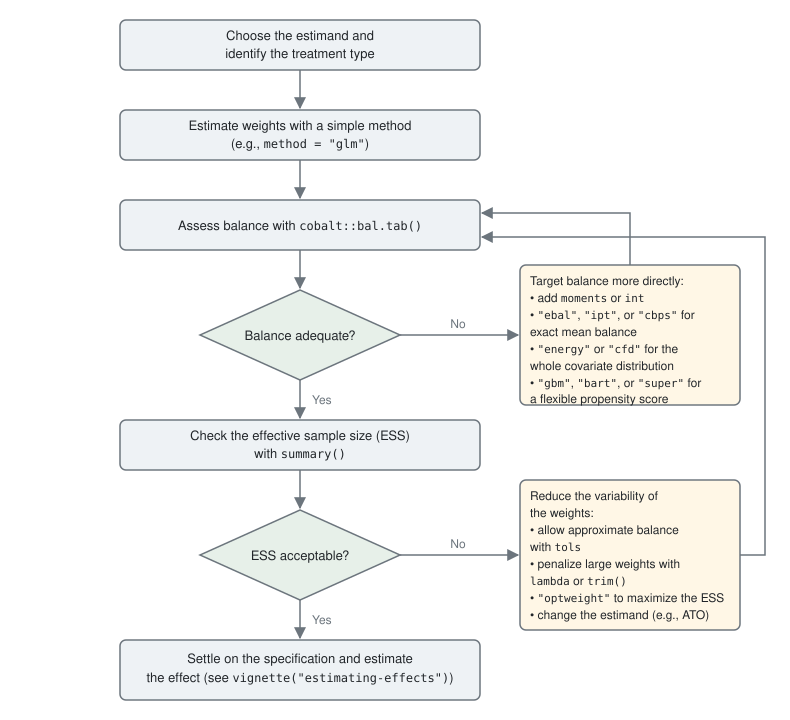

```{=html}
<style>
.scroll-table {
  overflow-x: auto;
  max-width: 100%;
  margin: 1em 0;
}
.scroll-table table {
  margin: 0;
}
.scroll-table th,
.scroll-table td {
  vertical-align: top;
}
.estimand-table th,
.estimand-table td {
  white-space: nowrap;
}
.scroll-table th:first-child,
.scroll-table td:first-child {
  position: sticky;
  left: 0;
  z-index: 1;
  background-color: var(--bs-body-bg, #fff);
  box-shadow: 1px 0 0 #ddd;
}
.methods-table th:nth-child(1),
.methods-table td:nth-child(1) { min-width: 6em; }
.methods-table th:nth-child(2),
.methods-table td:nth-child(2) { min-width: 13em; }
.methods-table th:nth-child(3),
.methods-table td:nth-child(3) { min-width: 5em; }
.methods-table th:nth-child(4),
.methods-table td:nth-child(4) { min-width: 10em; }
.methods-table th:nth-child(5),
.methods-table td:nth-child(5) { min-width: 10em; }
.methods-table th:nth-child(6),
.methods-table td:nth-child(6) { min-width: 8em; }
.methods-table th:nth-child(7),
.methods-table td:nth-child(7) { min-width: 7em; }
.methods-table th:nth-child(n+8),
.methods-table td:nth-child(n+8) { min-width: 18em; }
</style>
```

```{r setup, include=FALSE}
knitr::opts_chunk$set(echo = TRUE)
options(width = 200)
```

## Introduction

*WeightIt* implements several methods for estimating balancing weights, each with its own options. Though the help pages for the individual methods describe each method and how it can be used, this vignette provides a broad overview of the available weighting methods, the ideas behind them, and the circumstances in which each might be preferred. The choice of weighting method depends on the goals of the analysis (e.g., the estimand, whether low bias or high precision is more important, whether standard errors that account for the estimation of the weights are needed) and the unique qualities of each dataset to be analyzed, so there is no single optimal choice for any given analysis. A benefit of weighting as a preprocessing step is that a number of weighting methods can be tried and their quality assessed without consulting the outcome, reducing the possibility of capitalizing on chance while allowing for the benefits of an exploratory analysis in the design phase [@hoMatchingNonparametricPreprocessing2007; @rubinObjectiveCausalInference2008].

This vignette begins with a general explanation of weighting, the estimands that weights can target, and the ways weighting differs for binary, multi-category, and continuous treatments. It then describes each weighting method available in *WeightIt*, organized into three families: parametric methods, which estimate a propensity score with a parametric model; machine learning methods, which estimate a propensity score with a flexible model; and optimization-based methods, which estimate the weights directly by solving an optimization problem. It ends with guidance on choosing among them, a table summarizing when each method might be used, and a flowchart for moving through the selection process. No data are analyzed here; for an introduction to using the functions in *WeightIt*, see `vignette("WeightIt")`. For instructions on installing the packages some methods depend on, see `vignette("installing-packages")`. For details on how to estimate treatment effects and standard errors after weighting, see `vignette("estimating-effects")`. Weighting for longitudinal treatments and censoring weights are covered in `vignette("longitudinal-treatments")`; sampling weights and clustered data are not discussed here, and the `s.weights` and `formula` arguments of `weightit()` describe them.

## Weighting

Weighting is a method of adjusting for measured confounders in which each unit in the sample receives a weight, and the weighted sample is analyzed in place of the original sample. The weights are chosen so that in the weighted sample, the distribution of the covariates is the same across treatment groups and resembles the distribution of the covariates in a target population. Because the treatment is then unassociated with the covariates in the weighted sample, a comparison of the weighted outcomes between treatment groups is not confounded by the measured covariates, and when the measured covariates include all the confounders, the comparison estimates the causal effect of the treatment in the target population [@robinsMarginalStructuralModels2000; @hernanCausalInferenceWhat2020]. For introductions to weighting, see @austinIntroductionPropensityScore2011, @austinMovingBestPractice2015, @thoemmesPrimerInverseProbability2016, and @desaiAlternativeApproachesConfounding2019.

The most familiar form of weighting is inverse probability weighting, in which each unit's weight is the inverse of the probability of receiving the treatment it actually received, given its covariates. For a binary treatment, this probability is the propensity score, $e(X) = P(A = 1 | X)$, where $A$ is the treatment and $X$ the covariates [@rosenbaum1983]. Weighting treated units by $1/e(X)$ and control units by $1/(1 - e(X))$ creates a pseudo-population in which the treatment is independent of the covariates and each group resembles the full sample [@robinsMarginalStructuralModels2000; @luncefordStratificationWeightingPropensity2004]. In practice the propensity score is unknown and must be estimated, and the quality of the weights depends on how well it is estimated: a misspecified propensity score model yields weights that fail to balance the covariates, and the resulting effect estimate can be badly biased [@kangDemystifyingDoubleRobustness2007]. Much of the development of weighting methods over the past two decades has been in response to this sensitivity.

Weights can be estimated by modeling the treatment or by directly balancing the covariates [@chattopadhyayBalancingVsModeling2020; @ben-michaelBalancingActCausal2021]. The *modeling approach* fits a model for the treatment given the covariates and transforms the predicted probabilities (or densities) into weights using a formula that depends on the estimand. The parametric and machine learning methods in *WeightIt* follow this approach; they differ in the model used to estimate the propensity score. The *balancing approach* chooses the weights directly as the solution to an optimization problem in which covariate balance enters as a constraint or as the objective, without an explicit model for the treatment. The optimization-based methods in *WeightIt* follow this approach. The two are more closely related than they first appear: weights that exactly balance the covariate means correspond to the inverse of a propensity score estimated by a model whose loss function is tailored to balance rather than to fit [@zhaoEntropyBalancingDoubly2017; @zhaoCovariateBalancingPropensity2019; @wangMinimalDispersionApproximately2020], and the covariate balancing propensity score and inverse probability tilting sit between the two approaches, modifying the estimation of a parametric model so that balance is guaranteed.

Weighting as implemented in *WeightIt* is a form of nonparametric preprocessing in the sense of @hoMatchingNonparametricPreprocessing2007: the weights are estimated without reference to the outcome and are then supplied to an outcome model of the analyst's choosing, which may itself include the covariates. This differs from matching, as implemented in *MatchIt*, in that in general no units are discarded, and the weights can take on any nonnegative value rather than being restricted to counts of matches; see `vignette("matching-methods", package = "MatchIt")` for the matching analogue of this vignette. Weighting can target a wider range of estimands than most matching methods, extends naturally to multi-category and continuous treatments, and, with the optimization-based methods, can achieve exact balance on chosen features of the covariates. The cost is that nonuniform weights reduce precision, which is the trade-off discussed next.

### Balance and Effective Sample Size

A set of weights is judged by the balance it achieves and by the precision it retains, and the search for a weighting specification is a search for weights that do well on both.

**Balance.** The purpose of the weights is to remove the association between the treatment and the covariates, so the first criterion is the degree to which they do so, which is known as covariate balance. For binary and multi-category treatments, balance is assessed by comparing the weighted distribution of each covariate across treatment groups and against the target population, using statistics such as standardized mean differences, variance ratios, and Kolmogorov-Smirnov statistics [@austin2009; @harderPropensityScoreTechniques2010; @austinMovingBestPractice2015]. For continuous treatments, balance is assessed by the weighted correlation between the treatment and each covariate and by multivariate measures such as the distance covariance [@vegetabileNonparametricEstimationPopulation2021; @hulingIndependenceWeightsCausal2024]. Balance should be assessed on more than the covariate means: a weighted sample in which the means are balanced but the variances or the joint distribution of the covariates are not can still yield a biased estimate if the outcome depends on those features. Balance statistics are computed by the *cobalt* package, which *WeightIt* interfaces with directly; see `vignette("cobalt", package = "cobalt")` for how to assess and report balance. Because balance is a property of the weighted sample rather than of the model that produced the weights, it is the only direct evidence that a weighting specification has done its job; the fit of the propensity score model is only weakly related to the bias of the resulting estimate [@wyssRolePredictionModeling2014].

**Effective sample size.** Weights that vary across units reduce the precision of the weighted estimate relative to an unweighted estimate from the same number of units. The effective sample size (ESS) summarizes this loss as the size of an unweighted sample with approximately the same precision as the weighted sample, computed within each treatment group as $$\text{ESS} = \frac{\left(\sum_i w_i\right)^2}{\sum_i w_i^2}$$ [@mccaffrey2004; @shook-saPowerSampleSize2022]. The ESS equals the sample size when all the weights are equal and falls toward 1 as a few units come to dominate the weighted sample; it is reported by `summary()` on a `weightit` object. Extreme weights, which arise when some units have propensity scores near 0 or 1, are the usual cause of a low ESS, and they also make the estimate sensitive to the outcomes of the few heavily weighted units.

Balance and ESS tend to pull in opposite directions. Weights that achieve closer balance generally need to vary more, lowering the ESS, and weights that are constrained to be less variable generally leave some imbalance behind. Within a given method, this trade-off is controlled by options that relax the balance requirement or penalize the dispersion of the weights, and across methods it is reflected in which quantity the method prioritizes. Weight trimming (`trim()`), changing the estimand to one that targets a population with better overlap, and allowing approximate rather than exact balance are the usual ways of trading a little bias for a gain in precision [@coleConstructingInverseProbability2008; @leeWeightTrimmingPropensity2011; @wangMinimalDispersionApproximately2020]. The method and its options should be chosen so that balance is adequate first and the ESS is as large as possible given that balance.

### Estimands and Target Populations

Weights target an estimand, which is defined by the population to which the effect is meant to generalize and the contrast that is estimated. For a binary treatment, let $Y(1)$ and $Y(0)$ be the potential outcomes under treatment and control. The average treatment effect in the population (ATE), $E[Y(1) - Y(0)]$, is the average effect for the population from which the sample was drawn; the average treatment effect in the treated (ATT), $E[Y(1) - Y(0) | A = 1]$, is the average effect for units like those who received the treatment; and the average treatment effect in the control (ATC), $E[Y(1) - Y(0) | A = 0]$, is the average effect for units like those who did not. @greiferChoosingEstimandWhen2021 discuss how to choose among them; the choice should be made based on the substantive question before any weights are estimated, since it determines which methods are available and how the result is interpreted. The estimand is set by the `estimand` argument of `weightit()`; the default is `"ATE"`.

The weights for each estimand share a common form. Writing $h(X)$ for a function of the covariates known as the tilting function, the weights for a binary treatment are $$w_i = \frac{h(X_i)}{A_i e(X_i) + (1 - A_i)(1 - e(X_i))}$$ with the denominator being the probability of receiving the treatment actually received [@liBalancingCovariatesPropensity2018]. The tilting function determines the target population: the weighted sample resembles the population whose covariate density is proportional to $h(X)$ times the density of the covariates in the full sample. The estimands available in *WeightIt* and their tilting functions are the following:

::: {.scroll-table .estimand-table}
| Estimand | `estimand` | Target population | $h(X)$ | Treated weight | Control weight |
|---|---|---|---|---|---|
| ATE | `"ATE"` | full sample | $1$ | $1/e(X)$ | $1/(1 - e(X))$ |
| ATT | `"ATT"` | treated units | $e(X)$ | $1$ | $e(X)/(1 - e(X))$ |
| ATC | `"ATC"` | control units | $1 - e(X)$ | $(1 - e(X))/e(X)$ | $1$ |
| ATO | `"ATO"` | overlap population | $e(X)(1 - e(X))$ | $1 - e(X)$ | $e(X)$ |
| ATM | `"ATM"` | matched population | $\min\{e(X), 1 - e(X)\}$ | $\min\{e(X), 1 - e(X)\}/e(X)$ | $\min\{e(X), 1 - e(X)\}/(1 - e(X))$ |
| ATOS | `"ATOS"` | optimal subset | $\mathbb{1}(\alpha < e(X) < 1 - \alpha)$ | $\mathbb{1}(\cdot)/e(X)$ | $\mathbb{1}(\cdot)/(1 - e(X))$ |
:::

The ATE, ATT, and ATC weights are the classical inverse probability weights, and almost all methods in *WeightIt* can target these estimands. For the ATT, the treated units receive weights of 1 and only the control units are weighted, so the treated group is left intact and the control group is weighted to resemble it; the ATC is the reverse. ATE weights can be very large when some units have propensity scores near 0 or 1, since every unit must be reweighted to resemble the full sample, including units unlike any in the other group; the ATT and ATC are less affected but still require that every unit in the focal group have some chance of being in the other group [@austinMovingBestPractice2015].

The remaining three estimands change the target population to one in which the treatment groups overlap, trading a sample-defined population for bounded weights and a more precise estimate. The average treatment effect in the overlap (ATO) uses the overlap weights of @liBalancingCovariatesPropensity2018, which give the most weight to units about equally likely to be in either group and, with a logistic regression propensity score, yield exact balance on the covariate means; they perform well when overlap is limited [@liAddressingExtremePropensity2018; @zhouPropensityScoreWeighting2020]. The average treatment effect in the matched sample (ATM) uses the matching weights of @liWeightingAnaloguePair2013, which mimic 1:1 pair matching without replacement [see @yoshidaMatchingWeightsSimultaneously2017 for multi-category treatments], and the average treatment effect in the optimal subset (ATOS) uses the trimming rule of @crumpDealingLimitedOverlap2009, which discards units with propensity scores outside $[\alpha, 1 - \alpha]$, with $\alpha$ chosen to minimize the variance of the estimate. All three require a propensity score, so they are available only with the methods that estimate one, and because their target populations are defined by the propensity score rather than by the sample, the effect should be interpreted as applying to units in equipoise [@maoPropensityScoreWeighting2018; @greiferChoosingEstimandWhen2021]. The weights must also be used when averaging potential outcomes in effect estimation, as described in `vignette("estimating-effects")`.

The weights for the ATE can be stabilized by multiplying each unit's weight by the marginal probability of its observed treatment value, which is requested with `stabilize = TRUE`. Stabilization does not change the balance of the weighted sample or the target population, but it reduces the variability of the weights and improves the performance of estimators that use an unsaturated outcome model [@robinsMarginalStructuralModels2000; @coleConstructingInverseProbability2008]. It matters most for longitudinal treatments, and for a continuous treatment it is built into the weights by default, as described below.

### Treatment Types

*WeightIt* supports binary, multi-category, and continuous treatments. The treatment type is determined automatically from the treatment variable supplied in `formula`, and it determines how the propensity score is defined, how the weights are formed from it, and how balance is assessed.

**Binary treatments.** For a binary treatment, the propensity score is the probability of being treated given the covariates, and the weights are those in the table above. For methods that estimate a propensity score, it is returned in the `ps` component of the `weightit` object. Which value of the treatment is considered the treated group is determined by `weightit()` using a set of heuristics described at `?weightit`, and it can be set directly with the `focal` argument when the ATT or ATC is requested; it is safest to code the treatment as 0 for control and 1 for treated.

**Multi-category treatments.** For a treatment with more than two levels, the propensity score generalizes to the vector of probabilities of receiving each level, $p_a(X) = P(A = a | X)$ for each level $a$, which @imbensRolePropensityScore2000 calls the generalized propensity score. The weights take the same form as for a binary treatment, $w_i = h(X_i)/p_{A_i}(X_i)$, with the denominator being the probability of receiving the level actually received. For the ATE, $h(X) = 1$, so each group is weighted to resemble the full sample. For the ATT, one level is designated the focal group using `focal`, $h(X) = p_f(X)$ for that level $f$, and each of the other groups is weighted to resemble the focal group, which is left unweighted; the estimand is then the effect of each non-focal treatment relative to the focal treatment among units who received the focal treatment. The generalized overlap weights of @liPropensityScoreWeighting2019 extend the ATO with $h(X) = 1/\sum_a 1/p_a(X)$, the harmonic mean of the generalized propensity scores, and the matching weights of @yoshidaMatchingWeightsSimultaneously2017 extend the ATM with $h(X) = \min_a p_a(X)$. Balance is assessed between each pair of treatment groups or between each group and the target population [@mccaffreyTutorialPropensityScore2013a]. For the parametric and machine learning methods, the generalized propensity score is estimated by a multinomial model or by a series of binary models, one per level; for the optimization-based methods, the balance constraints or objective are applied to each group against the target population [@delosangelesresaDirectStableWeight2020]. For ordered treatments (i.e., `ordered` factors), `method = "glm"` fits an ordinal regression model. Effect estimation after weighting for a multi-category treatment is described in `vignette("estimating-effects")`.

**Continuous treatments.** For a continuous treatment, there is no probability of treatment to invert. The generalized propensity score is instead the conditional density of the treatment given the covariates, $f_{A|X}(a | X)$, evaluated at each unit's observed treatment value [@hiranoPropensityScoreContinuous2005; @imaiCausalInferenceGeneral2004], and the weights are $$w_i = \frac{f_A(A_i)}{f_{A|X}(A_i | X_i)}$$ where $f_A(a)$ is the marginal density of the treatment [@robinsMarginalStructuralModels2000]. In the weighted sample, the treatment is independent of the covariates, and the estimand is the average dose-response function, $E[Y(a)]$ as a function of the dose $a$, in the full sample; there is no analogue of the ATT, so the `estimand` argument is ignored. Balance is assessed by the weighted correlations between the treatment and the covariates, which should be close to 0, and by the distance covariance [@vegetabileNonparametricEstimationPopulation2021; @hulingIndependenceWeightsCausal2024]; see `vignette("estimating-effects")` for estimating the dose-response function after weighting.

The modeling methods require the analyst to specify the shape of the conditional density. By default, a normal density is used, with the conditional mean estimated by regressing the treatment on the covariates and the residual variance estimated from the fit, as recommended by @robinsMarginalStructuralModels2000. The `density` argument can be used to request other densities, such as a $t$-distribution, which @naimiConstructingInverseProbability2014 found to perform better when the treatment has heavy tails, or a kernel density estimate of the residuals. The weights are highly sensitive to this choice and to the specification of the conditional mean, and even small departures can produce extreme weights [@naimiConstructingInverseProbability2014; @zhuBoostingAlgorithmEstimating2015; @hulingIndependenceWeightsCausal2024]. The optimization-based methods avoid specifying a density altogether: entropy balancing and stable balancing weights constrain the weighted treatment-covariate correlations [@tubbickeEntropyBalancingContinuous2022; @vegetabileNonparametricEstimationPopulation2021; @greiferEstimatingBalancingWeights2020], and energy balancing minimizes the weighted distance covariance between the treatment and the covariates [@hulingIndependenceWeightsCausal2024]. For continuous treatments especially, these methods tend to be more reliable than the modeling methods.

## Weighting Methods

Below, we describe each of the weighting methods implemented in *WeightIt*, organized into the three families introduced above. Each method is requested by supplying its name to the `method` argument of `weightit()`, and each has a help page, named `method_` followed by the method name (e.g., `?method_glm`), that lists the treatment types and estimands it supports, the additional arguments it accepts, how it handles missing covariate values and sampling weights, and whether it supports M-estimation. M-estimation refers to the ability of `glm_weightit()` and related functions to compute standard errors that account for the estimation of the weights; for methods that do not support it, the bootstrap should be used instead. See `vignette("estimating-effects")` for details. The `.weightit_methods` object contains these properties for each method in a form that can be queried programmatically.

### Parametric Methods

Parametric methods estimate the propensity score with a parametric model for the treatment given the covariates and then convert the estimated propensity scores into weights using the formulas above. They are the oldest and most widely used weighting methods, they run quickly even on large datasets, and because the propensity score model has a finite set of parameters estimated by solving estimating equations, they support M-estimation. Their weakness is that the weights are only as good as the model: when the true propensity score is not of the assumed form, as when a nonlinear term or interaction is omitted, the estimated scores fail to balance the covariates, the weights can be extreme, and the effect estimate can be badly biased [@kangDemystifyingDoubleRobustness2007]. Covariate balancing propensity scores and inverse probability tilting respond to this by changing how the model's parameters are estimated so that balance on chosen moments of the covariates is guaranteed whether or not the model is correctly specified, which makes them considerably less sensitive to misspecification than maximum likelihood [@wyssRolePredictionModeling2014].

#### Propensity Score Weighting Using Generalized Linear Models (`method = "glm"`)

Propensity score weighting using generalized linear models is the default method in *WeightIt* and the classical form of inverse probability weighting. For a binary treatment, the propensity score is estimated by logistic regression of the treatment on the covariates [@rosenbaum1983; @austinIntroductionPropensityScore2011], and the weights are computed from the predicted probabilities for the requested estimand; all six estimands listed above are available. Other link functions, such as the probit or complementary log-log, can be requested with the `link` argument. See `?method_glm` for the documentation for `weightit()` with `method = "glm"`.

For multi-category treatments, the generalized propensity scores are estimated by multinomial logistic regression, implemented within *WeightIt* by default; the `multi.method` argument can be used to request a series of binomial models instead, or the implementations in the *mclogit* or *MNP* packages, and for ordered treatments an ordinal regression model is used. For continuous treatments, the conditional mean of the treatment is estimated by linear regression, and the conditional density is formed from the residuals using the distribution specified by `density`. The marginal density in the numerator is estimated by marginalizing over the conditional density.

Several refinements to the standard model are available. When the treatment groups are nearly separated by the covariates or one group is small, maximum likelihood estimates can be infinite or badly biased and the resulting propensity scores extreme; adding a `br.` prefix to `link` (e.g., `link = "br.logit"`) requests the bias-reduced estimates of @firthBiasReductionMaximum1993, which are always finite, and `link = "flic"` or `"flac"` requests the Firth-corrected logistic regression models of @puhrFirthsLogisticRegression2017, which additionally correct the predicted probabilities. When units are clustered, random effects terms in the *lme4* style can be included in `formula` to fit a multilevel propensity score model [@liPropensityScoreWeighting2013]. Setting `missing = "saem"` fits the model directly to covariates with missing values using the stochastic approximation EM algorithm of @jiangLogisticRegressionMissing2019 rather than adding missingness indicators. Supplying a number to `subclass` requests marginal mean weighting through stratification, described under Additional Options below. M-estimation is supported except with the Firth-corrected links, multilevel models, `missing = "saem"`, `subclass`, or a kernel density estimate.

Because the model is specified by the analyst, its specification should be chosen with balance in mind rather than with prediction of the treatment in mind: squared terms, interactions, and transformations of the covariates should be added to the formula until the covariates are balanced in the weighted sample [@austinMovingBestPractice2015; @wyssRolePredictionModeling2014]. Logistic regression propensity scores can produce extreme weights when there is limited overlap, so the ESS should be examined alongside balance, and trimming or an overlap-based estimand considered when it is low. Even when another method is ultimately chosen, this method is a natural starting point and a useful benchmark, since it is fast, well understood, and the standard against which other methods are compared.

#### Covariate Balancing Propensity Score Weighting (`method = "cbps"`)

The covariate balancing propensity score (CBPS) of @imaiCovariateBalancingPropensity2014 estimates the parameters of a logistic regression propensity score model not by maximum likelihood but by the generalized method of moments, using conditions that require the weighted covariate means to be balanced. In the just-identified version, which is the default (`over = FALSE`), the balance conditions replace the usual score equations entirely, so there are exactly as many conditions as parameters and the solution yields exact balance on the means of the covariates in the model (and on any additional terms requested with `moments`, `int`, or `quantile`). In the over-identified version (`over = TRUE`), the balance conditions are combined with the score equations, so the estimated parameters compromise between fitting the treatment and balancing the covariates, and balance is improved relative to maximum likelihood but not exact. See `?method_cbps` for the documentation for `weightit()` with `method = "cbps"`. CBPS is implemented within *WeightIt* and does not require the *CBPS* package, though the two implementations differ in some defaults and in the versions available; see the help page for details.

CBPS can be used with binary, multi-category, and continuous treatments. For binary treatments, the ATE, ATT, ATC, and ATO are available; the ATO weights of @liBalancingCovariatesPropensity2018 already balance the covariate means exactly when the propensity score is estimated by logistic regression, so for the ATO the just-identified CBPS and maximum likelihood coincide. For multi-category treatments, the parameters of a multinomial logistic regression model are estimated so that each group is balanced to the target. For continuous treatments, the method of @fongCovariateBalancingPropensity2018 estimates the parameters of a linear regression model for the treatment so that the weighted correlations between the treatment and the covariates are 0, with the normal density used to form the weights; the *WeightIt* implementation departs slightly from theirs in treating the treatment mean and variance as parameters to be estimated. M-estimation is supported for the just-identified CBPS with binary and multi-category treatments. In simulations, CBPS has been found to balance the covariates better and yield less biased estimates than maximum likelihood when the propensity score model is misspecified [@wyssRolePredictionModeling2014].

The just-identified CBPS is closely related to entropy balancing and inverse probability tilting, described below; all three solve for weights that exactly balance the covariate means, and for the ATT with the logit link they yield identical weights. For other estimands they differ in the function of the weights that is implicitly minimized, and in practice the differences in the resulting weights are usually small. Note that the balance conditions do not always have a solution, most often with a continuous treatment and many covariates; `weightit()` warns when the optimizer settles at a point where the conditions are unmet, and balance should then be checked rather than assumed to be exact.

#### Inverse Probability Tilting (`method = "ipt"`)

Inverse probability tilting (IPT), proposed by @grahamInverseProbabilityTilting2012, estimates the parameters of a logistic regression (or other generalized linear model) propensity score model by solving a modified set of score equations, chosen so that the resulting weights exactly balance the covariate means between each weighted group and the target population. For the ATE, two sets of parameters are estimated, one tilting the treated group toward the full sample and one tilting the control group; for the ATT, the version described by @santannaDoublyRobustDifferenceindifferences2020 is used, in which only the control group is tilted toward the treated group. See `?method_ipt` for the documentation for `weightit()` with `method = "ipt"`. IPT is implemented within *WeightIt* using the *rootSolve* package to solve the estimating equations.

IPT can be used with binary and multi-category treatments, for which the ATE, ATT, and ATC are available; it is not available for continuous treatments. Additional balance constraints can be requested with `moments`, `int`, and `quantile`, and the link function can be changed with `link`, though some links allow negative weights and should be used with caution. M-estimation is supported in all cases. For the ATT with the logit link, IPT, entropy balancing, and the just-identified CBPS yield identical weights; for the ATE they differ, because IPT fits a separate model for each group. @grahamInverseProbabilityTilting2012 show that the IPT estimator of the ATE is consistent if either the propensity score follows the assumed logistic model or the outcome is linear in the covariates within each treatment group, a form of double robustness that the other two methods have only under narrower conditions (for the ATT in the case of entropy balancing, and when there is no effect modification by the covariates in the case of the just-identified CBPS). This additional guarantee comes at some potential cost in precision.

### Machine Learning Methods

Machine learning methods estimate the propensity score with a flexible model that does not require the analyst to specify the functional form of the relationship between the covariates and the treatment. Their motivation is the misspecification problem of parametric models: a model that can represent nonlinearities and interactions on its own has a better chance of recovering the true propensity score when its form is unknown, and simulation studies have found that boosted trees and other flexible learners can outperform a misspecified logistic regression in balancing the covariates and reducing bias [@setoguchiEvaluatingUsesData2008; @leeImprovingPropensityScore2010; @westreichPropensityScoreEstimation2010; @cannasComparisonMachineLearning2019a]. These methods can be used with binary, multi-category, and continuous treatments and can target all the estimands available to `method = "glm"`.

The flexibility has costs. A model that fits the treatment too well produces propensity scores near 0 and 1, and therefore extreme weights, even when the true propensity scores are moderate; the tuning parameters that govern this trade-off must be chosen, and because prediction accuracy is only weakly related to the bias of the weighted estimate [@wyssRolePredictionModeling2014], it is better to choose them by the balance they produce than by cross-validated prediction error, as @mccaffrey2004 proposed for boosted models. Even with balance-based tuning, there is no guarantee that any specification balances the covariates adequately, so balance must be checked as with any method. The models take longer to fit than parametric models, sometimes much longer, and M-estimation is not available, so standard errors must be computed by bootstrapping. Propensity scores from machine learning models are often poorly calibrated, and calibrating them before forming the weights, as `calibrate()` does, can improve the resulting estimates [@gutmanImprovingInverseProbability2024; @vanderlaanStabilizedInverseProbability2025]; see Additional Options below. Machine learning methods are most useful with many covariates or when their relationship to the treatment is likely to be complex, and least useful when a parametric model is approximately correct, in which case they tend to perform worse than the parametric model [@mccaffrey2004].

#### Propensity Score Weighting Using Generalized Boosted Models (`method = "gbm"`)

Generalized boosted modeling (GBM, also known as gradient boosting) builds a prediction for the treatment as a sum of many small regression trees, each fit to the residuals of the trees before it. @mccaffrey2004 introduced it for propensity score estimation and made the key suggestion that the number of trees, which controls how flexible the model is, be chosen to optimize covariate balance in the weighted sample rather than prediction of the treatment; @mccaffreyTutorialPropensityScore2013a extended the method to multi-category treatments and @zhuBoostingAlgorithmEstimating2015 to continuous treatments. The implementation in *WeightIt* uses the *gbm* package to fit the model and mirrors the functionality of the *twang* package, the first to implement this method, with additional options and estimands. See `?method_gbm` for the documentation for `weightit()` with `method = "gbm"`.

The balance criterion used to select the number of trees is set with `criterion`; the default is the mean absolute standardized mean difference across the covariates for binary and multi-category treatments and the mean absolute treatment-covariate correlation for continuous treatments, and any of the statistics available in `cobalt::bal.compute()` can be used instead, as can cross-validated prediction error. The maximum number of trees is set with `n.trees`, and if the best balance is found at or near the maximum, the model should be refit with a larger value; `plot()` on the output displays the criterion against the number of trees. Other tuning parameters, including the depth of the trees (`interaction.depth`), the shrinkage applied to each tree (`shrinkage`), and the fraction of units used to fit each tree (`bag.fraction`), can be supplied with several values each, in which case `weightit()` fits a model for each combination and selects the one with the best balance. @griffinChasingBalanceOther2017 examine the choice of balance criterion and of the number of trees and offer recommendations for both. Setting `use.offset = TRUE` includes the linear predictor of a generalized linear model as an offset, so the trees model only the departures from that model, which can improve performance when the true propensity score is close to a generalized linear model. The weights can be trimmed before the best number of trees is selected using `trim.at`, which is helpful when a few extreme weights would otherwise dominate the balance criterion, as is common with continuous treatments. GBM is well suited to capturing nonlinear and nonadditive treatment models but tends to perform worse than logistic regression when the treatment model is simple [@mccaffrey2004].

#### Propensity Score Weighting Using SuperLearner (`method = "super"`)

SuperLearner is a stacking method that fits several candidate models (the "library") to the treatment and covariates and combines their predictions in a weighted average, with the combination weights chosen by cross-validation [@pirracchioImprovingPropensityScore2015]. Its appeal is the oracle property: asymptotically, the combined prediction performs as well as the best model in the library, so including a variety of candidates, such as a logistic regression, a boosted model, and a regularized regression, protects against choosing a single poor model. @kreifEvaluationEffectContinuous2015 describe its use for continuous treatments. The implementation in *WeightIt* uses the *SuperLearner* package, and the library must be supplied through `SL.library`; `SuperLearner::listWrappers()` lists the available candidates. See `?method_super` for the documentation for `weightit()` with `method = "super"`.

By default, the combination weights are chosen by nonnegative least squares on the cross-validated predictions. Setting `discrete = TRUE` instead selects the single best-performing candidate. Setting `SL.method = "method.balance"` requests the balance SuperLearner of @pirracchioBalanceSuperLearner2018, in which the combination weights are chosen to optimize a balance criterion, specified with `criterion`, rather than cross-validated prediction error, in the same spirit as balance-based tuning for GBM; this is available for binary and continuous treatments. For multi-category treatments, one SuperLearner is fit for each treatment level. Because several models are fit and cross-validated, this method can be slow, and the results depend on which candidates are included. It is a reasonable choice when there is genuine uncertainty about which model is appropriate for the propensity score and the sample is large enough to support cross-validation.

#### Propensity Score Weighting Using BART (`method = "bart"`)

Bayesian additive regression trees (BART) is a Bayesian sum-of-trees model in which each tree is constrained by a regularization prior to be a weak learner, so that the sum captures complex functions without overfitting [@chipmanBARTBayesianAdditive2010]. For propensity score estimation, the posterior mean of the predicted probability of treatment (or of the conditional mean of a continuous treatment) is used as the propensity score [@hillChallengesPropensityScore2011]. Unlike GBM and SuperLearner, BART does not optimize a loss function or require tuning by cross-validation or balance; the default priors tend to work well with little modification, which makes it the simplest of the machine learning methods to use. The implementation in *WeightIt* uses the *dbarts* package, and all of its arguments can be passed through `weightit()`. See `?method_bart` for the documentation for `weightit()` with `method = "bart"`.

As with GBM, `use.offset = TRUE` adds the linear predictor of a generalized linear model as an offset. Random effects terms can be included in `formula` to fit a multilevel BART model using the *stan4bart* package. BART has a random component, so the `seed` argument should be supplied (or `set.seed()` called with `n.threads = 1`) to make the results reproducible. Sampling weights are not supported, and, as with the other machine learning methods, M-estimation is not available. Note that much of the literature on BART for causal inference concerns modeling the outcome rather than the treatment, so the evidence specific to BART-estimated propensity scores is thinner than for GBM.

### Optimization-Based Methods

Optimization-based methods estimate the weights directly, as the solution to an optimization problem in which covariate balance appears either as a set of constraints or as the objective, and the remaining freedom in the weights is used to keep them as uniform as possible [@zubizarretaStableWeightsThat2015; @chattopadhyayBalancingVsModeling2020; @ben-michaelBalancingActCausal2021]. No propensity score model is specified, so there is no model to misspecify in the usual sense; instead, the analyst specifies what is to be balanced (the covariates in the formula and, optionally, higher-order terms, interactions, and quantiles), and the method guarantees balance on those features, exactly or to within a tolerance. These methods originate in survey calibration, and @chanGloballyEfficientNonparametric2016 show that a broad class of them can attain the semiparametric efficiency bound for the ATE when the set of balanced functions grows with the sample size. Relatedly, weights that exactly balance the covariate means are the inverse propensity scores from a model fit with a loss function tailored to balance, so the choice of what to balance plays the role that model specification plays for parametric methods [@zhaoEntropyBalancingDoubly2017; @zhaoCovariateBalancingPropensity2019; @wangMinimalDispersionApproximately2020].

Within this family, the methods differ in what they balance and in how they measure the dispersion of the weights. Entropy balancing, stable balancing weights, and nonparametric CBPS balance moments of the covariates, so balance on the specified features is exact (or within tolerance) and nothing is guaranteed about features not specified. Energy balancing and characteristic function distance balancing instead minimize a measure of the distance between the entire weighted covariate distribution and the target, so all features of the joint distribution are balanced, though none exactly. Exact balance on many features can require extreme weights, so the ESS can be low; allowing approximate balance or penalizing the dispersion of the weights recovers precision at the cost of a little imbalance [@wangMinimalDispersionApproximately2020]. Because no propensity score is estimated, only the ATE, ATT, and ATC are available, and no propensity score is returned. Among these methods, only entropy balancing supports M-estimation.

#### Entropy Balancing (`method = "ebal"`)

Entropy balancing, proposed by @hainmuellerEntropyBalancingCausal2012, finds the weights that minimize the Kullback-Leibler divergence from a set of base weights (uniform by default) subject to the constraints that the weighted means of the covariates in each weighted group equal those in the target population and that the weights sum to a fixed value. The problem is solved through its dual, which has one parameter per balance constraint and is unconstrained, so it is fast and reliable even with many units. The result is exact mean balance on every term in the model, which can be extended to higher moments, interactions, and quantiles with `moments`, `int`, and `quantile`. See `?method_ebal` for the documentation for `weightit()` with `method = "ebal"`. Entropy balancing is implemented within *WeightIt* and requires no additional packages.

@zhaoEntropyBalancingDoubly2017 showed that entropy balancing for the ATT is equivalent to fitting a logistic regression propensity score model with a loss function that enforces balance, and that it is doubly robust: the estimate is consistent if either the propensity score is a logistic regression in the balanced terms or the outcome in the control group is linear in them. @kallbergLargeSampleProperties2023 study its properties for the ATE. For continuous treatments, the method of @tubbickeEntropyBalancingContinuous2022 and @vegetabileNonparametricEstimationPopulation2021 constrains the weighted treatment-covariate correlations to be 0 and the weighted moments of the treatment and covariates to equal their unweighted values; @vegetabileNonparametricEstimationPopulation2021 recommend holding the first three moments fixed, which is requested with `d.moments = 3`. Approximate balance can be requested with `tols`, in which case a regularized version of the problem is solved and the weights are less variable, and previously estimated weights can be supplied as `base.weights` so the new weights depart from them as little as possible. M-estimation is supported whenever `tols` is 0. For the ATT, entropy balancing yields the same weights as the just-identified CBPS and IPT. It is often a good first choice among the optimization-based methods: it is fast, requires no additional packages, guarantees mean balance, and supports M-estimation.

#### Stable Balancing Weights (`method = "optweight"`)

Stable balancing weights, proposed by @zubizarretaStableWeightsThat2015, are the weights of minimum variance that satisfy balance constraints, which may be approximate: each weighted covariate mean is required to be within a tolerance of its target rather than equal to it. The problem is a quadratic program, solved with the *osqp* package through the *optweight* package, and the result directly maximizes the ESS subject to the chosen degree of balance. The tolerance is set with `tols` as a maximum allowed standardized mean difference. @wangMinimalDispersionApproximately2020 study the asymptotic properties of these weights and show that allowing approximate balance can improve precision while retaining consistency when the tolerances shrink with the sample size. See `?method_optweight` for the documentation for `weightit()` with `method = "optweight"`.

Stable balancing weights can be used with binary and multi-category treatments [@delosangelesresaDirectStableWeight2020] and with continuous treatments, for which the constraints are on the weighted treatment-covariate correlations [@greiferEstimatingBalancingWeights2020]. The function of the weights that is minimized can be changed with `norm`: the default `"l2"` minimizes their variance; `"entropy"` minimizes their negative entropy, which makes the method a version of entropy balancing that allows approximate balance; and `"log"` minimizes the sum of the negative logs of the weights, which corresponds to the nonparametric CBPS described next. The dual variables for the balance constraints, available through `plot()`, indicate how much each constraint costs in terms of the dispersion of the weights, which can guide the choice of which constraints to relax. M-estimation is not supported. Because `optweight::optweight()` offers finer control over the tolerances and uses the same syntax as `weightit()`, it is recommended for stable balancing weights in place of `weightit()` with `method = "optweight"`.

#### Nonparametric Covariate Balancing Propensity Score Weighting (`method = "npcbps"`)

The nonparametric CBPS of @fongCovariateBalancingPropensity2018 finds the weights that maximize the empirical likelihood of the data subject to the constraints that the weighted covariate means (for binary and multi-category treatments) or the weighted treatment-covariate correlations (for continuous treatments) are balanced. It is similar to entropy balancing with a different measure of dispersion and generally produces similar weights. The implementation in *WeightIt* uses the *CBPS* package, and only the ATE is available; sampling weights and M-estimation are not supported. See `?method_npcbps` for the documentation for `weightit()` with `method = "npcbps"`.

Because the optimization problem is not convex, the solver can be slow to converge or fail to converge, and the `corprior` argument allows approximate balance to make the problem easier. The same weights can be estimated more reliably, with more estimands and with approximate balance controlled directly, by setting `norm = "log"` with `method = "optweight"`, so the latter is generally preferred; setting `method = "npcbps"` remains useful mainly to reproduce analyses that used the *CBPS* package.

#### Energy Balancing (`method = "energy"`)

Energy balancing, proposed by @hulingEnergyBalancingCovariate2024, chooses the weights that minimize the energy distance between the weighted covariate distribution of each treatment group and that of the target population. The energy distance between two multivariate distributions $F$ and $G$ is $$\mathcal{E}(F, G) = 2\,E\|X - Y\| - E\|X - X'\| - E\|Y - Y'\|$$ where $X, X' \sim F$ and $Y, Y' \sim G$ are independent; it is 0 only when the two distributions are identical, so minimizing it balances all features of the joint covariate distribution rather than a chosen set of moments. The weighted energy distance is a quadratic function of the weights, so the problem is a quadratic program, solved with the *osqp* package. See `?method_energy` for the documentation for `weightit()` with `method = "energy"`.

For binary and multi-category treatments, the ATE, ATT, and ATC are available, and by default the improved version of @hulingEnergyBalancingCovariate2024 is used for the ATE, which also minimizes the energy distance between each pair of treatment groups. For continuous treatments, the independence weights of @hulingIndependenceWeightsCausal2024 minimize the weighted distance covariance between the treatment and the covariates, a measure of dependence that is 0 only under independence, along with the energy distances between the weighted and unweighted distributions of the treatment and of the covariates. Exact balance on the means (or correlations) can be added as constraints with `moments` and `int`, which guarantees mean balance while the energy distance is minimized among weights that satisfy it; the constraints can be relaxed with `tols`. The `lambda` argument penalizes the variance of the weights and can be increased when the ESS is low. The distance between units is the Euclidean distance on the scaled covariates by default and can be changed with `dist.mat`. Because the energy distance involves all pairs of units, the method requires memory proportional to the square of the sample size and can be slow or infeasible for samples beyond several thousand units. M-estimation is not supported. Energy balancing is a good choice when balance on the full joint distribution of the covariates is desired, for example when the outcome model is expected to be nonlinear or to involve interactions and it is unclear which terms to balance.

#### Characteristic Function Distance Balancing (`method = "cfd"`)

Characteristic function distance (CFD) balancing, proposed by @santraDistributionalBalancingCausal2026, generalizes energy balancing by replacing the energy distance with a weighted integrated squared difference between the characteristic functions of the two distributions. The weighting function in that integral corresponds to a kernel, and different kernels emphasize different features of the distributions; the CFD is closely related to the maximum mean discrepancy with the corresponding kernel, which connects the method to kernel balancing [@wongKernelbasedCovariateFunctional2018; @hazlettKernelBalancingFlexible2020]. The kernel is chosen with `kernel`; the default is the multivariate Gaussian kernel, and the Matern, Laplace, and $t$ kernels are also available. With `kernel = "energy"`, the CFD is the energy distance and the method is identical to energy balancing. @santraDistributionalBalancingCausal2026 compare the kernels and relate each to assumptions about the form of the outcome model. See `?method_cfd` for the documentation for `weightit()` with `method = "cfd"`.

CFD balancing is available for binary and multi-category treatments only. Its options parallel those of energy balancing: exact mean balance can be added with `moments` and `int` and relaxed with `tols`, the `lambda` argument penalizes the variance of the weights, and the improved version is used for the ATE by default. The bandwidth of the kernel is set to the median pairwise distance between units by default and can be scaled with `bw_scale`. The same computational considerations as for energy balancing apply, and M-estimation is not supported.

## Additional Options

Several options are shared across methods and change what the weights target or how they are processed after estimation. The help page for each method says which of them apply.

### Balancing Higher Moments, Interactions, and Quantiles (`moments`, `int`, `quantile`)

For the methods that balance moments of the covariates (CBPS, IPT, entropy balancing, stable balancing weights, nonparametric CBPS, and, as additional constraints, energy and CFD balancing), the terms balanced are the covariates in `formula` by default. Setting `moments` to an integer greater than 1 adds powers of each continuous covariate up to that order, so `moments = 2` balances the means and variances; setting `int = TRUE` adds all first-order interactions between covariates; and supplying `quantile` adds variables that, when balanced, ensure balance on the requested quantiles of each continuous covariate (binary and multi-category treatments only). These options extend exact mean balance toward balance on the full distribution at the cost of more constraints, and therefore more variable weights, so they should be added when balance on the corresponding features is inadequate rather than by default. Functions of the covariates can also be included directly in `formula` (e.g., `I(age^2)` or `age:educ`), which works for every method.

### Stabilizing Weights (`stabilize`)

Setting `stabilize = TRUE` multiplies each unit's ATE weight by the marginal probability of its observed treatment, and a formula can be supplied instead to use the predicted probability from a model with the given predictors in the numerator [@robinsMarginalStructuralModels2000; @coleConstructingInverseProbability2008]. Stabilization is mainly useful for longitudinal treatments; for continuous treatments it is built into the weights, so `stabilize = TRUE` leaves them unchanged. It is available only for the ATE and only with `method = "glm"`, `"gbm"`, `"super"`, or `"bart"`; the `stabilize_ok` component of `.weightit_methods` lists the methods that allow it.

### Trimming Weights (`trim()`)

`trim()` winsorizes the largest weights by setting all weights above a chosen quantile (or the chosen number of largest weights) to the weight at that quantile, or optionally sets them to 0 to drop the units. Trimming reduces the variability of the weights and increases the ESS, but it can worsen balance and, when the trimmed units are influential, bias the estimate; it also changes the target population when the estimand is the ATE, since the units whose weights were trimmed no longer receive the weight needed to represent their part of the population [@coleConstructingInverseProbability2008; @leeWeightTrimmingPropensity2011]. Balance should be assessed again after trimming. An overlap-based estimand such as the ATO achieves a similar reduction in the variability of the weights without an arbitrary cutoff, and it is often preferable when the target population is not important.

### Calibrating Propensity Scores (`calibrate()`)

`calibrate()` refits the propensity score as a function of the previously estimated propensity score alone, using logistic regression (Platt scaling) as described by @gutmanImprovingInverseProbability2024 or isotonic regression as described by @vanderlaanStabilizedInverseProbability2025, and recomputes the weights from the calibrated score. Machine learning methods often produce propensity scores that discriminate well between the groups but are poorly calibrated, with predicted probabilities more extreme than the true ones, and calibration corrects this, which can improve both the balance and the ESS of the resulting weights. It applies to binary treatments and to any method that returns a propensity score.

### Marginal Mean Weighting Through Stratification (`subclass`)

With `method = "glm"`, `"gbm"`, `"super"`, or `"bart"`, supplying a number to `subclass` requests marginal mean weighting through stratification [MMWS; @hongMarginalMeanWeighting2010; @hongMarginalMeanWeighting2012], also known as fine stratification weighting [@desai2017]. The units are divided into subclasses based on quantiles of the propensity score, and the propensity score used to form the weights is replaced by the proportion of units in each treatment group within each subclass, so the weights are constant within subclasses. This coarsening makes the weights less sensitive to the exact values of the propensity scores and limits their variability, at the cost of residual imbalance within subclasses; with many subclasses, the weights approach the standard inverse probability weights. The number of subclasses should be chosen by examining balance, and `cobalt::bal.compute()` can be used to select it. M-estimation is not available when `subclass` is used.

### Supplying Propensity Scores (`ps`)

Propensity scores estimated outside *WeightIt* can be supplied to the `ps` argument of `weightit()`, in which case no model is fit and the scores are converted to weights for the requested estimand exactly as they would be for `method = "glm"`; see `?method_ps` for the accepted forms. This makes the estimand, trimming, calibration, and balance assessment machinery of *WeightIt* available for weights derived from any propensity score model, though M-estimation is not available, since the model that produced the scores is unknown. `get_w_from_ps()` performs the same conversion but returns only the weights.

## Choosing a Weighting Method

Choosing a weighting method for one's data depends on the unique characteristics of the dataset and the goals of the analysis. Below we offer some guidance, but the choice cannot be settled by guidance alone: the only sufficient justification for a weighting specification is adequate balance and an acceptable ESS in the weighted sample, and both must be assessed for each candidate. Because the weights are estimated without reference to the outcome, many specifications can and should be tried, and the search should not stop at the first specification that crosses a balance threshold but should continue toward the best balance that can be achieved while retaining an adequate ESS [@hoMatchingNonparametricPreprocessing2007; @rubinObjectiveCausalInference2008]. Balance should be assessed broadly, on the means, variances, and distributions of the covariates and on their interactions, since a specification can balance the means while leaving the rest of the distribution imbalanced [@austin2009; @harderPropensityScoreTechniques2010].

The estimand determines which methods are available. The ATE, ATT, and ATC can be targeted by almost every method. The ATO, ATM, and ATOS require a propensity score and so are available only with the parametric and machine learning methods; when the target population is less important than precision or than avoiding extrapolation into regions of poor overlap, the ATO is the natural choice among them [@liBalancingCovariatesPropensity2018; @maoPropensityScoreWeighting2018]. When the ATE is the target and overlap is poor, no method will produce weights that are both balanced and stable, and the choice is between accepting a low ESS, trimming, and changing the estimand.

The treatment type also narrows the options. For continuous treatments, the modeling methods require a correctly specified conditional density and are sensitive to its misspecification, so the optimization-based methods, which avoid the density altogether, are usually preferable: entropy balancing with `d.moments = 3`, stable balancing weights, or energy balancing [@vegetabileNonparametricEstimationPopulation2021; @hulingIndependenceWeightsCausal2024]. If a modeling method is used for a continuous treatment, the `density` argument should be varied, the weights trimmed, and balance assessed on the treatment-covariate correlations and the distance covariance. For multi-category treatments, all methods except IPT and CFD balancing (for the ATC) and nonparametric CBPS (for anything but the ATE) are available, and the considerations are the same as for binary treatments.

The need for standard errors that account for the estimation of the weights favors the methods that support M-estimation: `"glm"`, `"cbps"` (just-identified, binary and multi-category), `"ipt"`, and `"ebal"` (with `tols = 0`). For the others, the bootstrap must be used, which is straightforward with `glm_weightit()` but can be slow for methods that are themselves slow to fit, such as GBM, SuperLearner, and energy balancing with large samples. See `vignette("estimating-effects")` for details.

Within these constraints, a reasonable strategy is to begin with `method = "glm"`, which is fast and serves as a benchmark, and to assess balance. If the covariate means are imbalanced, an optimization-based method that guarantees mean balance, such as entropy balancing, or a parametric method with the same guarantee, such as the just-identified CBPS or IPT, will remove that imbalance directly, usually with a smaller loss in ESS than refitting the logistic regression model repeatedly would achieve. If the means are balanced but the variances, distributions, or interactions are not, higher moments and interactions can be added to the balance constraints with `moments` and `int`, or energy or CFD balancing can be used to balance the whole joint distribution. Machine learning methods are most useful when the covariates are numerous and their relationship to the treatment is likely to involve nonlinearities and interactions that are hard to anticipate; GBM with balance-based tuning is the most studied of them, SuperLearner protects against choosing a single poor model, and BART requires the least tuning. Their weights should always be checked for balance and extremity, and calibration should be considered.

If balance is adequate but the ESS is unacceptably low, the options are to relax the balance requirement, as with `tols` in stable balancing weights or entropy balancing, which trades a controlled amount of imbalance for precision [@wangMinimalDispersionApproximately2020]; to penalize the variance of the weights with `lambda` in energy or CFD balancing; to trim the weights; or to change the estimand to the ATO or another overlap-based estimand. Stable balancing weights are the method designed for this situation, since they maximize the ESS directly for a given level of balance. Balance should be assessed again after any of these changes.

For large datasets (i.e., in the tens of thousands of units or more), the parametric methods and entropy balancing scale well, as do stable balancing weights for moderate numbers of constraints. Energy and CFD balancing require a matrix of distances between all pairs of units and become slow or infeasible beyond several thousand units. GBM, SuperLearner, and BART can take a long time to fit on large samples, especially when tuning parameters are searched over.

It is important not to rely excessively on theoretical or simulation-based findings when making these choices. A method that performed best in a published simulation did so for the data-generating processes that simulation considered, and the method that performs best for a given dataset can only be identified by examining balance and ESS in that dataset [@wyssRolePredictionModeling2014]. In the same way, the guidance above describes tendencies, and there is no reason not to try several methods, varying their options, in search of good balance and a high ESS; as noted at the outset, no single method can be recommended above all others.

### Summary of the Weighting Methods

The table below summarizes the capabilities of each method and the circumstances in which it might be considered; it scrolls horizontally, with the method name fixed. Treatment types are abbreviated as B (binary), M (multi-category), and C (continuous). Estimands listed are those available for binary treatments; the help page for each method lists those available for multi-category treatments.

::: {.scroll-table .methods-table}
| `method` | Name | Treatments | Estimands | Balance targeted | M-estimation | Required package | Strengths | Limitations | Consider when |
|---|---|---|---|---|---|---|---|---|---|
| `"glm"` | Propensity score weighting using GLMs | B, M, C | ATE, ATT, ATC, ATO, ATM, ATOS | None guaranteed | Yes | None | Fast; well understood; the standard against which other methods are compared | Sensitive to model misspecification; weights can be extreme with poor overlap | Starting out, as a benchmark; the treatment model is likely close to a GLM |
| `"cbps"` | Covariate balancing propensity score weighting | B, M, C | ATE, ATT, ATC, ATO | Exact means (just-identified) | Yes (just-identified; B, M) | None | Exact mean balance from a parametric model; ATO available | Balance only on the specified moments; conditions may be unsolvable with continuous treatments | A propensity score model is wanted but mean balance must be guaranteed |
| `"ipt"` | Inverse probability tilting | B, M | ATE, ATT, ATC | Exact means | Yes | *rootSolve* | Exact mean balance; double robustness for the ATE | Some loss of precision relative to entropy balancing and CBPS | The ATE is the target and theoretical guarantees are valued |
| `"gbm"` | Propensity score weighting using GBM | B, M, C | ATE, ATT, ATC, ATO, ATM | Tuned to a balance criterion | No | *gbm* | Captures nonlinearity and interactions; balance-based tuning; well studied | Slow; must be tuned; can overfit | Many covariates with an unknown functional form |
| `"super"` | Propensity score weighting using SuperLearner | B, M, C | ATE, ATT, ATC, ATO, ATM, ATOS | None guaranteed (or tuned to a balance criterion) | No | *SuperLearner* | Combines several models; oracle property; balance-based option | Slow; results depend on the library | The appropriate model is uncertain and the sample is large |
| `"bart"` | Propensity score weighting using BART | B, M, C | ATE, ATT, ATC, ATO, ATM, ATOS | None guaranteed | No | *dbarts* | Flexible with little tuning; random effects available | No sampling weights; less studied for propensity scores | A flexible model is wanted without a tuning search |
| `"ebal"` | Entropy balancing | B, M, C | ATE, ATT, ATC | Exact (or approximate) means | Yes (with `tols = 0`) | None | Exact mean balance; fast; doubly robust for the ATT | Balance only on the specified moments; ESS can be low with many constraints | Mean imbalance remains after `"glm"`; the default among optimization-based methods |
| `"optweight"` | Stable balancing weights | B, M, C | ATE, ATT, ATC | Approximate means | No | *optweight* | Maximizes the ESS for a chosen balance tolerance; dual variables | The tolerance must be chosen | The ESS is too low under exact balance; precision is a priority |
| `"npcbps"` | Nonparametric CBPS weighting | B, M, C | ATE | Exact means | No | *CBPS* | Empirical likelihood weights with exact balance | Nonconvex and slow; no sampling weights | Reproducing an analysis that used the *CBPS* package; otherwise use `"optweight"` with `norm = "log"` |
| `"energy"` | Energy balancing | B, M, C | ATE, ATT, ATC | Full distribution | No | *osqp* | Balances the whole joint distribution; continuous treatments without a density | Memory and time grow with the square of the sample size | The outcome model may be nonlinear or the terms to balance are unknown; continuous treatments |
| `"cfd"` | Characteristic function distance balancing | B, M | ATE, ATT, ATC | Full distribution | No | *osqp* | Distributional balance with a choice of kernel; energy balancing as a special case | Same cost as energy balancing | Distributional balance with control over which features are emphasized |
:::

### A Workflow for Selecting a Method

The flowchart below summarizes the process of selecting a weighting method by examining balance and the ESS for each candidate specification.

{width="100%"}

The process begins with the estimand and the treatment type, which together fix the set of methods available. A simple method, usually `method = "glm"`, is used first, and balance is assessed with `cobalt::bal.tab()`. If balance is inadequate, the next candidate should target balance more directly: by adding terms with `moments` or `int`, by using a method that guarantees mean balance (entropy balancing, IPT, or the just-identified CBPS), by using a method that balances the full distribution (energy or CFD balancing), or by using a flexible propensity score model (GBM, SuperLearner, or BART). If balance is adequate, the ESS is examined with `summary()`. If it is unacceptably low, the variability of the weights should be reduced by allowing approximate balance with `tols`, penalizing large weights with `lambda` or `trim()`, using stable balancing weights to maximize the ESS directly, or changing the estimand to one with better overlap. Each of these changes returns the process to the assessment of balance, since any change to the weights can change the balance they achieve. When both balance and the ESS are acceptable, the specification is settled, and the effect can be estimated as described in `vignette("estimating-effects")`. At no point in this process is the outcome consulted.

## Reporting the Weighting Specification

When reporting the results of a weighting analysis, it is important to include the relevant details of the final weighting specification and the process of arriving at it. Using `print()` on the `weightit` object synthesizes information on the method, estimand, and options used to provide a description of the weighting specification, and `summary()` reports the distribution of the weights and the ESS. It is best to be as specific as possible to ensure the analysis is replicable and to allow audiences to assess its validity. Although citations recommending specific weighting methods can be used to help justify a choice, the only sufficient justification is adequate balance and an adequate ESS, regardless of published recommendations for specific methods. The methods page for the chosen method lists the references that should be cited for it, and `citation("WeightIt")` provides the citation for the package. See `vignette("cobalt", package = "cobalt")` for instructions on how to assess and report the quality of a weighting specification. After weighting and estimating an effect, details of the effect estimation must be included as well; see `vignette("estimating-effects")` for instructions on how to perform and report on the analysis of a weighted dataset.

## References
